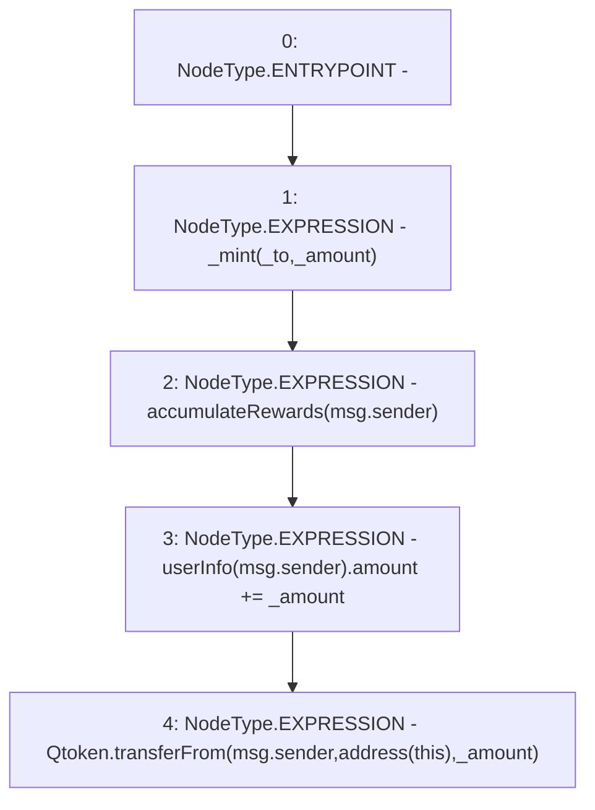

# Context: WBQI.wrap

**Contract:** `WBQI` (Inherits: IWAsset, ERC20_8, IERC20)
**Signature:** `wrap(uint256,address,address,address)`
**Method Selector ID:** `0x932eeefe`
**Visibility:** `external`
**Environment-Free:** `No (reads EVM state context)`
**Modifiers:** None

### State Variables Interaction
- **Reads:** Qtoken, userInfo
- **Writes:** userInfo

### Environment & Verification Flags
- **Uses Foundry Cheatcodes:** No
- **Has Echidna Properties:** No

### Internal Calls Tree
- None

### External Calls / Value Transfers
- `IERC20.TMP_54(bool) = HIGH_LEVEL_CALL, dest:Qtoken(IERC20), function:transferFrom, arguments:['msg.sender', 'TMP_53', '_amount']  `

### Control Flow Graph (CFG)


### Source Mapping
Declared in: `certora-ac-datasets/detasets/web3bugs/dataset/web3bugs/66/packages/contracts/contracts/AssetWrappers/WBQI.sol` on lines **106** to **116**

```solidity
    function wrap(uint _amount, address _from, address _to, address _rewardRecipient) external override {
        
        //Update rewards

        _mint(_to, _amount);
        accumulateRewards(msg.sender);
        userInfo[msg.sender].amount += _amount;

        Qtoken.transferFrom(msg.sender, address(this), _amount);
        
    }

```
