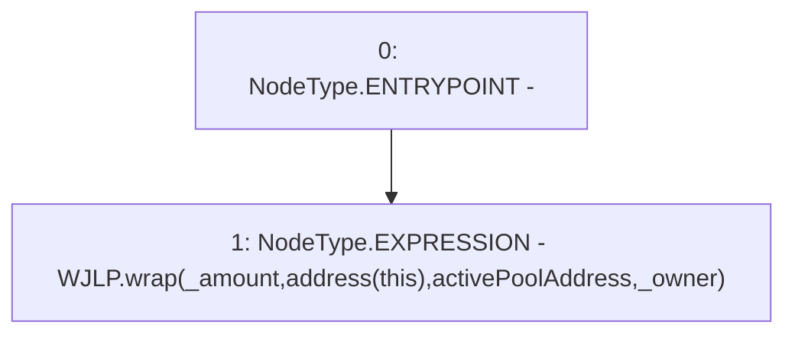

# Context: WJLPRouter._wrapJLP

**Contract:** `WJLPRouter` (Inherits: IYetiRouter)
**Signature:** `_wrapJLP(uint256,address,address)`
**Method Selector ID:** `Internal (No Method ID)`
**Visibility:** `internal`
**Environment-Free:** `Yes`
**Modifiers:** None

### State Variables Interaction
- **Reads:** WJLP, activePoolAddress
- **Writes:** None

### Environment & Verification Flags
- **Uses Foundry Cheatcodes:** No
- **Has Echidna Properties:** No

### Internal Calls Tree
- None

### External Calls / Value Transfers
- `IWAsset.HIGH_LEVEL_CALL, dest:WJLP(IWAsset), function:wrap, arguments:['_amount', 'TMP_46', 'activePoolAddress', '_owner']  `

### Control Flow Graph (CFG)


### Source Mapping
Declared in: `certora-ac-datasets/detasets/web3bugs/dataset/web3bugs/66/packages/contracts/contracts/Routers/WJLPRouter.sol` on lines **93** to **99**

```solidity
    function _wrapJLP(
        uint256 _amount,
        address _fromUser,
        address _owner
    ) internal {
        WJLP.wrap(_amount, address(this), activePoolAddress, _owner);
    }

```
