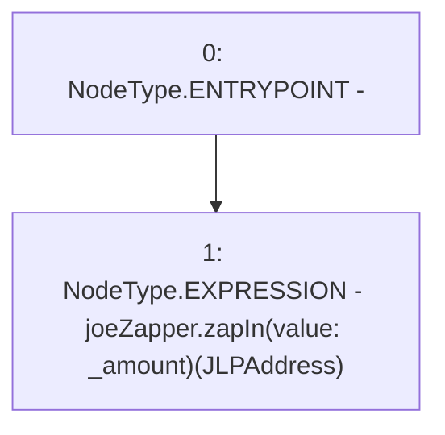

# Context: WJLPRouter._zapInAvax

**Contract:** `WJLPRouter` (Inherits: IYetiRouter)
**Signature:** `_zapInAvax(uint256)`
**Method Selector ID:** `Internal (No Method ID)`
**Visibility:** `internal`
**Environment-Free:** `Yes`
**Modifiers:** None

### State Variables Interaction
- **Reads:** JLPAddress, joeZapper
- **Writes:** None

### Environment & Verification Flags
- **Uses Foundry Cheatcodes:** No
- **Has Echidna Properties:** No

### Internal Calls Tree
- None

### External Calls / Value Transfers
- `IJoeZapper.HIGH_LEVEL_CALL, dest:joeZapper(IJoeZapper), function:zapIn, arguments:['JLPAddress'] value:_amount `

### Control Flow Graph (CFG)


### Source Mapping
Declared in: `certora-ac-datasets/detasets/web3bugs/dataset/web3bugs/66/packages/contracts/contracts/Routers/WJLPRouter.sol` on lines **102** to **105**

```solidity
    function _zapInAvax(uint256 _amount) internal {
        // _to is the resultJLP
        joeZapper.zapIn{value: _amount}(JLPAddress);
    }

```
