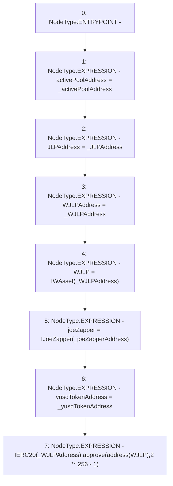

# Context: WJLPRouter.constructor

**Contract:** `WJLPRouter` (Inherits: IYetiRouter)
**Signature:** `constructor(address,address,address,address,address)`
**Method Selector ID:** `0x5607425a`
**Visibility:** `public`
**Environment-Free:** `Yes`
**Modifiers:** None

### State Variables Interaction
- **Reads:** WJLP
- **Writes:** JLPAddress, WJLP, WJLPAddress, activePoolAddress, joeZapper, yusdTokenAddress

### Environment & Verification Flags
- **Uses Foundry Cheatcodes:** No
- **Has Echidna Properties:** No

### Internal Calls Tree
- None

### External Calls / Value Transfers
- `IERC20.TMP_26(bool) = HIGH_LEVEL_CALL, dest:TMP_22(IERC20), function:approve, arguments:['TMP_23', 'TMP_25']  `

### Control Flow Graph (CFG)


### Source Mapping
Declared in: `certora-ac-datasets/detasets/web3bugs/dataset/web3bugs/66/packages/contracts/contracts/Routers/WJLPRouter.sol` on lines **21** to **36**

```solidity
    constructor(
        address _activePoolAddress,
        address _JLPAddress,
        address _WJLPAddress,
        address _joeZapperAddress,
        address _yusdTokenAddress
    ) public {
        activePoolAddress = _activePoolAddress;
        JLPAddress = _JLPAddress;
        WJLPAddress = _WJLPAddress;
        WJLP = IWAsset(_WJLPAddress);
        joeZapper = IJoeZapper(_joeZapperAddress);
        yusdTokenAddress = _yusdTokenAddress;
        // Approve the WJLP contract to take any of this contract's JLP tokens.
        IERC20(_WJLPAddress).approve(address(WJLP), 2**256 - 1);
    }

```
