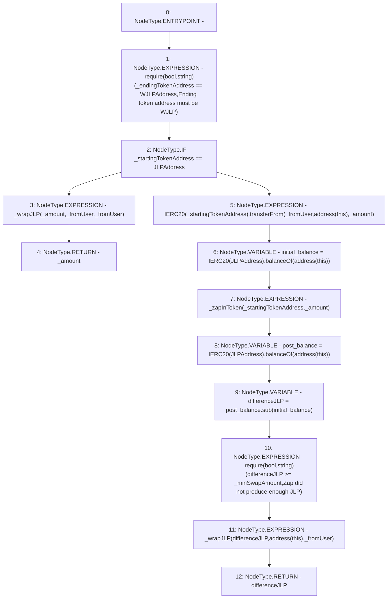

# Context: WJLPRouter.route

**Contract:** `WJLPRouter` (Inherits: IYetiRouter)
**Signature:** `route(address,address,address,uint256,uint256) returns (uint256)`
**Method Selector ID:** `0x40dbf962`
**Visibility:** `public`
**Environment-Free:** `Yes`
**Modifiers:** None

### State Variables Interaction
- **Reads:** JLPAddress, WJLPAddress
- **Writes:** None

### Assertion Checks & Business Requirements
- require/assert: `require(bool,string)(_endingTokenAddress == WJLPAddress,Ending token address must be WJLP)`
- require/assert: `require(bool,string)(differenceJLP >= _minSwapAmount,Zap did not produce enough JLP)`

### Environment & Verification Flags
- **Uses Foundry Cheatcodes:** No
- **Has Echidna Properties:** No

### Internal Calls Tree
- None

### External Calls / Value Transfers
- `IERC20.TMP_40(uint256) = HIGH_LEVEL_CALL, dest:TMP_38(IERC20), function:balanceOf, arguments:['TMP_39']  `
- `IERC20.TMP_36(uint256) = HIGH_LEVEL_CALL, dest:TMP_34(IERC20), function:balanceOf, arguments:['TMP_35']  `
- `SafeMath.TMP_41(uint256) = LIBRARY_CALL, dest:SafeMath, function:SafeMath.sub(uint256,uint256), arguments:['post_balance', 'initial_balance'] `
- `IERC20.TMP_33(bool) = HIGH_LEVEL_CALL, dest:TMP_31(IERC20), function:transferFrom, arguments:['_fromUser', 'TMP_32', '_amount']  `

### Control Flow Graph (CFG)


### Source Mapping
Declared in: `certora-ac-datasets/detasets/web3bugs/dataset/web3bugs/66/packages/contracts/contracts/Routers/WJLPRouter.sol` on lines **42** to **66**

```solidity
    function route(
        address _fromUser,
        address _startingTokenAddress,
        address _endingTokenAddress,
        uint256 _amount,
        uint256 _minSwapAmount
    ) public override returns (uint256) {
        require(_endingTokenAddress == WJLPAddress, "Ending token address must be WJLP");
        // JLP -> WJLP then send to active pool
        if (_startingTokenAddress == JLPAddress) {
            _wrapJLP(_amount, _fromUser, _fromUser);
            return _amount;
        }
        // Other ERC20 -> JLP -> WJLP then send to active pool
        else {
            IERC20(_startingTokenAddress).transferFrom(_fromUser, address(this), _amount);
            uint256 initial_balance = IERC20(JLPAddress).balanceOf(address(this));
            _zapInToken(_startingTokenAddress, _amount);
            uint256 post_balance = IERC20(JLPAddress).balanceOf(address(this));
            uint256 differenceJLP = post_balance.sub(initial_balance);
            require(differenceJLP >= _minSwapAmount, "Zap did not produce enough JLP");
            _wrapJLP(differenceJLP, address(this), _fromUser);
            return differenceJLP;
        }
    }

```
