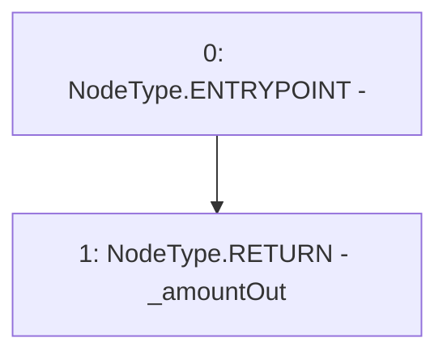

# Context: WJLPRouter.unRoute

**Contract:** `WJLPRouter` (Inherits: IYetiRouter)
**Signature:** `unRoute(address,address,address,uint256,uint256) returns (uint256)`
**Method Selector ID:** `0xa7b8a537`
**Visibility:** `external`
**Environment-Free:** `Yes`
**Modifiers:** None

### State Variables Interaction
- **Reads:** None
- **Writes:** None

### Environment & Verification Flags
- **Uses Foundry Cheatcodes:** No
- **Has Echidna Properties:** No

### Internal Calls Tree
- None

### External Calls / Value Transfers
- None

### Control Flow Graph (CFG)


### Source Mapping
Declared in: `certora-ac-datasets/detasets/web3bugs/dataset/web3bugs/66/packages/contracts/contracts/Routers/WJLPRouter.sol` on lines **68** to **76**

```solidity
    function unRoute(
        address _fromUser,
        address _startingTokenAddress,
        address _endingTokenAddress,
        uint256 _amount,
        uint256 _minSwapAmount
    ) external override returns (uint256 _amountOut) {
        // todo
    }

```
