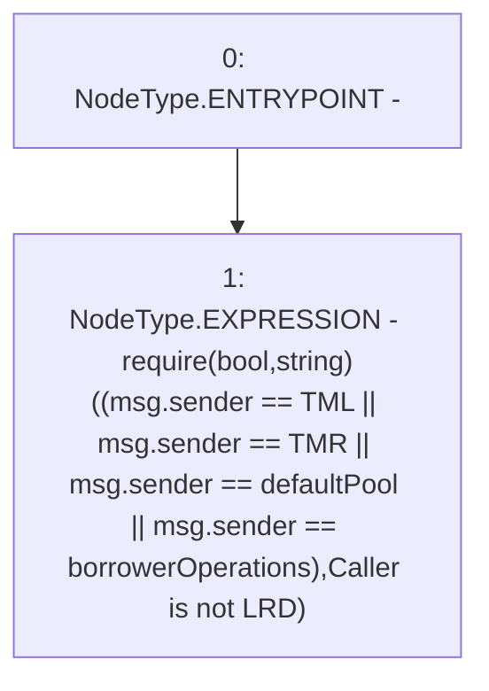

# Context: WJLP._requireCallerIsLRDorBO

**Contract:** `WJLP` (Inherits: IWAsset, ERC20_8, IERC20)
**Signature:** `_requireCallerIsLRDorBO()`
**Method Selector ID:** `Internal (No Method ID)`
**Visibility:** `internal`
**Environment-Free:** `No (reads EVM state context)`
**Modifiers:** None

### State Variables Interaction
- **Reads:** TML, TMR, borrowerOperations, defaultPool
- **Writes:** None

### Assertion Checks & Business Requirements
- require/assert: `require(bool,string)((msg.sender == TML || msg.sender == TMR || msg.sender == defaultPool || msg.sender == borrowerOperations),Caller is not LRD)`

### Environment & Verification Flags
- **Uses Foundry Cheatcodes:** No
- **Has Echidna Properties:** No

### Internal Calls Tree
- None

### External Calls / Value Transfers
- None

### Control Flow Graph (CFG)


### Source Mapping
Declared in: `certora-ac-datasets/detasets/web3bugs/dataset/web3bugs/66/packages/contracts/contracts/AssetWrappers/WJLP.sol` on lines **376** to **384**

```solidity
    function _requireCallerIsLRDorBO() internal view {
        require(
            (msg.sender == TML ||
             msg.sender == TMR ||
             msg.sender == defaultPool || 
             msg.sender == borrowerOperations),
            "Caller is not LRD"
        );
    }

```
