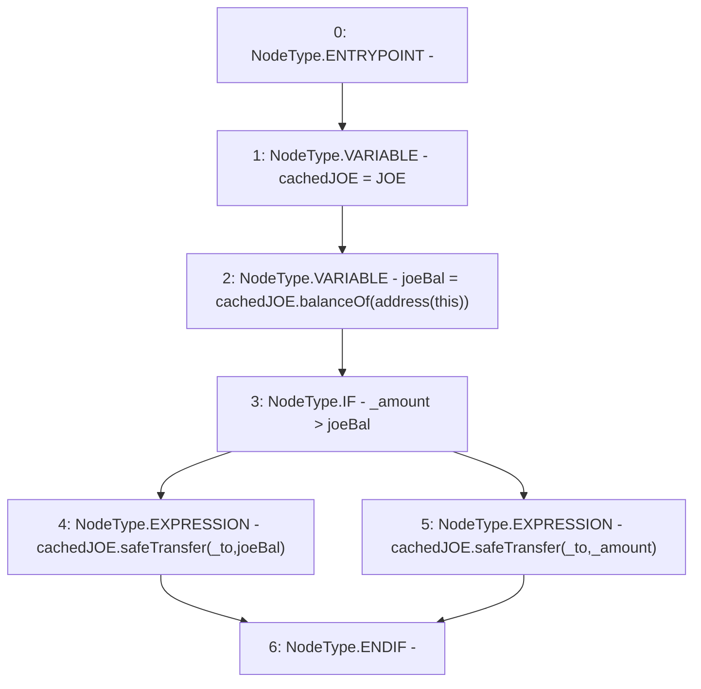

# Context: WJLP._safeJoeTransfer

**Contract:** `WJLP` (Inherits: IWAsset, ERC20_8, IERC20)
**Signature:** `_safeJoeTransfer(address,uint256)`
**Method Selector ID:** `Internal (No Method ID)`
**Visibility:** `internal`
**Environment-Free:** `Yes`
**Modifiers:** None

### State Variables Interaction
- **Reads:** JOE
- **Writes:** None

### Environment & Verification Flags
- **Uses Foundry Cheatcodes:** No
- **Has Echidna Properties:** No

### Internal Calls Tree
- None

### External Calls / Value Transfers
- `SafeERC20.LIBRARY_CALL, dest:SafeERC20, function:SafeERC20.safeTransfer(IERC20,address,uint256), arguments:['cachedJOE', '_to', '_amount'] `
- `SafeERC20.LIBRARY_CALL, dest:SafeERC20, function:SafeERC20.safeTransfer(IERC20,address,uint256), arguments:['cachedJOE', '_to', 'joeBal'] `
- `IERC20.TMP_201(uint256) = HIGH_LEVEL_CALL, dest:cachedJOE(IERC20), function:balanceOf, arguments:['TMP_200']  `

### Control Flow Graph (CFG)


### Source Mapping
Declared in: `certora-ac-datasets/detasets/web3bugs/dataset/web3bugs/66/packages/contracts/contracts/AssetWrappers/WJLP.sol` on lines **345** to **353**

```solidity
    function _safeJoeTransfer(address _to, uint256 _amount) internal {
        IERC20 cachedJOE = JOE;
        uint256 joeBal = cachedJOE.balanceOf(address(this));
        if (_amount > joeBal) {
            cachedJOE.safeTransfer(_to, joeBal);
        } else {
            cachedJOE.safeTransfer(_to, _amount);
        }
    }

```
