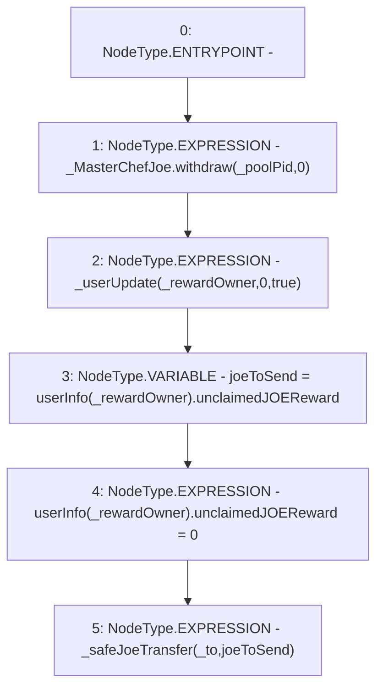

# Context: WJLP._sendJoeReward

**Contract:** `WJLP` (Inherits: IWAsset, ERC20_8, IERC20)
**Signature:** `_sendJoeReward(address,address)`
**Method Selector ID:** `Internal (No Method ID)`
**Visibility:** `internal`
**Environment-Free:** `Yes`
**Modifiers:** None

### State Variables Interaction
- **Reads:** _MasterChefJoe, _poolPid, userInfo
- **Writes:** userInfo

### Environment & Verification Flags
- **Uses Foundry Cheatcodes:** No
- **Has Echidna Properties:** No

### Internal Calls Tree
- None

### External Calls / Value Transfers
- `IMasterChefJoeV2.HIGH_LEVEL_CALL, dest:_MasterChefJoe(IMasterChefJoeV2), function:withdraw, arguments:['_poolPid', '0']  `

### Control Flow Graph (CFG)


### Source Mapping
Declared in: `certora-ac-datasets/detasets/web3bugs/dataset/web3bugs/66/packages/contracts/contracts/AssetWrappers/WJLP.sol` on lines **305** to **315**

```solidity
    function _sendJoeReward(address _rewardOwner, address _to) internal {
        // harvests all JOE that the WJLP contract is owed
        _MasterChefJoe.withdraw(_poolPid, 0);

        // updates user.unclaimedJOEReward with latest data from TJ
        _userUpdate(_rewardOwner, 0, true);

        uint joeToSend = userInfo[_rewardOwner].unclaimedJOEReward;
        userInfo[_rewardOwner].unclaimedJOEReward = 0;
        _safeJoeTransfer(_to, joeToSend);
    }

```
