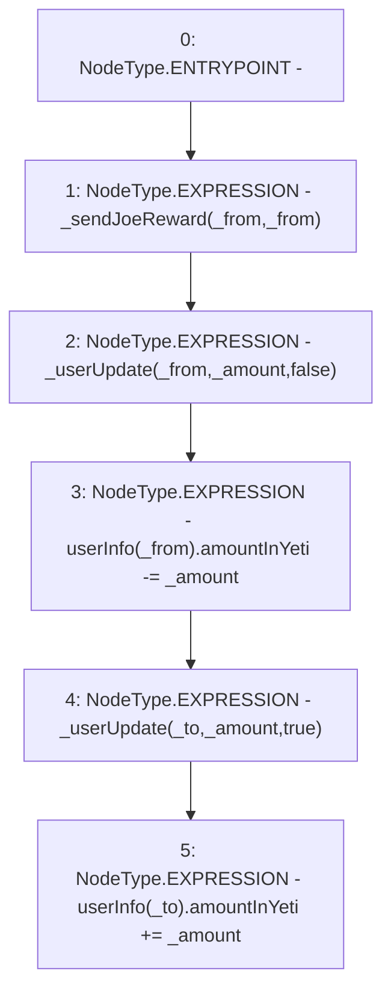

# Context: WJLP._updateReward

**Contract:** `WJLP` (Inherits: IWAsset, ERC20_8, IERC20)
**Signature:** `_updateReward(address,address,uint256)`
**Method Selector ID:** `Internal (No Method ID)`
**Visibility:** `internal`
**Environment-Free:** `Yes`
**Modifiers:** None

### State Variables Interaction
- **Reads:** userInfo
- **Writes:** userInfo

### Environment & Verification Flags
- **Uses Foundry Cheatcodes:** No
- **Has Echidna Properties:** No

### Internal Calls Tree
- None

### External Calls / Value Transfers
- None

### Control Flow Graph (CFG)


### Source Mapping
Declared in: `certora-ac-datasets/detasets/web3bugs/dataset/web3bugs/66/packages/contracts/contracts/AssetWrappers/WJLP.sol` on lines **265** to **272**

```solidity
    function _updateReward(address _from, address _to, uint _amount) internal {
        // Claim any outstanding reward first 
        _sendJoeReward(_from, _from);
        _userUpdate(_from, _amount, false);
        userInfo[_from].amountInYeti -= _amount;
        _userUpdate(_to, _amount, true);
        userInfo[_to].amountInYeti += _amount;
    }

```
