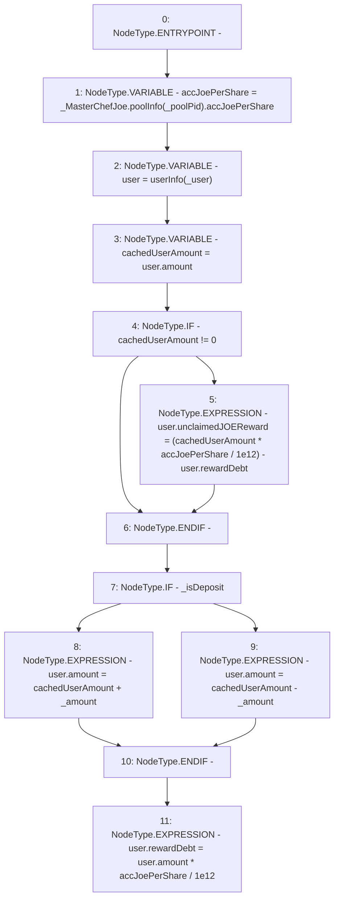

# Context: WJLP._userUpdate

**Contract:** `WJLP` (Inherits: IWAsset, ERC20_8, IERC20)
**Signature:** `_userUpdate(address,uint256,bool)`
**Method Selector ID:** `Internal (No Method ID)`
**Visibility:** `private`
**Environment-Free:** `Yes`
**Modifiers:** None

### State Variables Interaction
- **Reads:** _MasterChefJoe, _poolPid, userInfo
- **Writes:** userInfo

### Environment & Verification Flags
- **Uses Foundry Cheatcodes:** No
- **Has Echidna Properties:** No

### Internal Calls Tree
- None

### External Calls / Value Transfers
- `IMasterChefJoeV2.TMP_191(IMasterChefJoeV2.PoolInfo) = HIGH_LEVEL_CALL, dest:_MasterChefJoe(IMasterChefJoeV2), function:poolInfo, arguments:['_poolPid']  `

### Control Flow Graph (CFG)


### Source Mapping
Declared in: `certora-ac-datasets/detasets/web3bugs/dataset/web3bugs/66/packages/contracts/contracts/AssetWrappers/WJLP.sol` on lines **322** to **340**

```solidity
    function _userUpdate(address _user, uint256 _amount, bool _isDeposit) private {
        // latest accumulated Joe Per Share:
        uint256 accJoePerShare = _MasterChefJoe.poolInfo(_poolPid).accJoePerShare;
        UserInfo storage user = userInfo[_user];
        uint256 cachedUserAmount = user.amount;

        if (cachedUserAmount != 0) {
            user.unclaimedJOEReward = (cachedUserAmount * accJoePerShare / 1e12) - user.rewardDebt;
        }

        if (_isDeposit) {
            user.amount = cachedUserAmount + _amount;
        } else {
            user.amount = cachedUserAmount - _amount;
        }

        // update for JOE rewards that are already accounted for in user.unclaimedJOEReward
        user.rewardDebt = user.amount * accJoePerShare / 1e12;
    }

```
