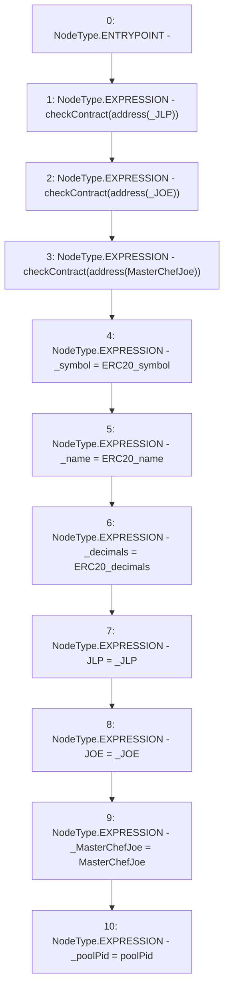

# Context: WJLP.constructor

**Contract:** `WJLP` (Inherits: IWAsset, ERC20_8, IERC20)
**Signature:** `constructor(string,string,uint8,IERC20,IERC20,IMasterChefJoeV2,uint256)`
**Method Selector ID:** `0x13085d57`
**Visibility:** `public`
**Environment-Free:** `Yes`
**Modifiers:** None

### State Variables Interaction
- **Reads:** None
- **Writes:** JLP, JOE, _MasterChefJoe, _decimals, _name, _poolPid, _symbol

### Environment & Verification Flags
- **Uses Foundry Cheatcodes:** No
- **Has Echidna Properties:** No

### Internal Calls Tree
- None

### External Calls / Value Transfers
- None

### Control Flow Graph (CFG)


### Source Mapping
Declared in: `certora-ac-datasets/detasets/web3bugs/dataset/web3bugs/66/packages/contracts/contracts/AssetWrappers/WJLP.sol` on lines **83** to **104**

```solidity
    constructor(string memory ERC20_symbol,
        string memory ERC20_name,
        uint8 ERC20_decimals,
        IERC20 _JLP,
        IERC20 _JOE,
        IMasterChefJoeV2 MasterChefJoe,
        uint256 poolPid) {

        checkContract(address(_JLP));
        checkContract(address(_JOE));
        checkContract(address(MasterChefJoe));

        _symbol = ERC20_symbol;
        _name = ERC20_name;
        _decimals = ERC20_decimals;

        JLP = _JLP;
        JOE = _JOE;

        _MasterChefJoe = MasterChefJoe;
        _poolPid = poolPid;
    }

```
