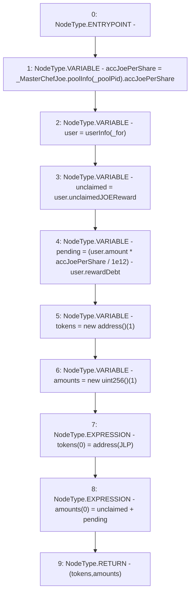

# Context: WJLP.getPendingRewards

**Contract:** `WJLP` (Inherits: IWAsset, ERC20_8, IERC20)
**Signature:** `getPendingRewards(address) returns (address[], uint256[])`
**Method Selector ID:** `0xf6ed2017`
**Visibility:** `external`
**Environment-Free:** `Yes`
**Modifiers:** None

### State Variables Interaction
- **Reads:** JLP, _MasterChefJoe, _poolPid, userInfo
- **Writes:** None

### Environment & Verification Flags
- **Uses Foundry Cheatcodes:** No
- **Has Echidna Properties:** No

### Internal Calls Tree
- None

### External Calls / Value Transfers
- `IMasterChefJoeV2.TMP_177(IMasterChefJoeV2.PoolInfo) = HIGH_LEVEL_CALL, dest:_MasterChefJoe(IMasterChefJoeV2), function:poolInfo, arguments:['_poolPid']  `

### Control Flow Graph (CFG)


### Source Mapping
Declared in: `certora-ac-datasets/detasets/web3bugs/dataset/web3bugs/66/packages/contracts/contracts/AssetWrappers/WJLP.sol` on lines **275** to **290**

```solidity
    function getPendingRewards(address _for) external view override returns
        (address[] memory, uint[] memory)  {
        // latest accumulated Joe Per Share:
        uint256 accJoePerShare = _MasterChefJoe.poolInfo(_poolPid).accJoePerShare;
        UserInfo storage user = userInfo[_for];

        uint unclaimed = user.unclaimedJOEReward;
        uint pending = (user.amount * accJoePerShare / 1e12) - user.rewardDebt;

        address[] memory tokens = new address[](1);
        uint[] memory amounts = new uint[](1);
        tokens[0] = address(JLP);
        amounts[0] = unclaimed + pending;

        return (tokens, amounts);
    }

```
