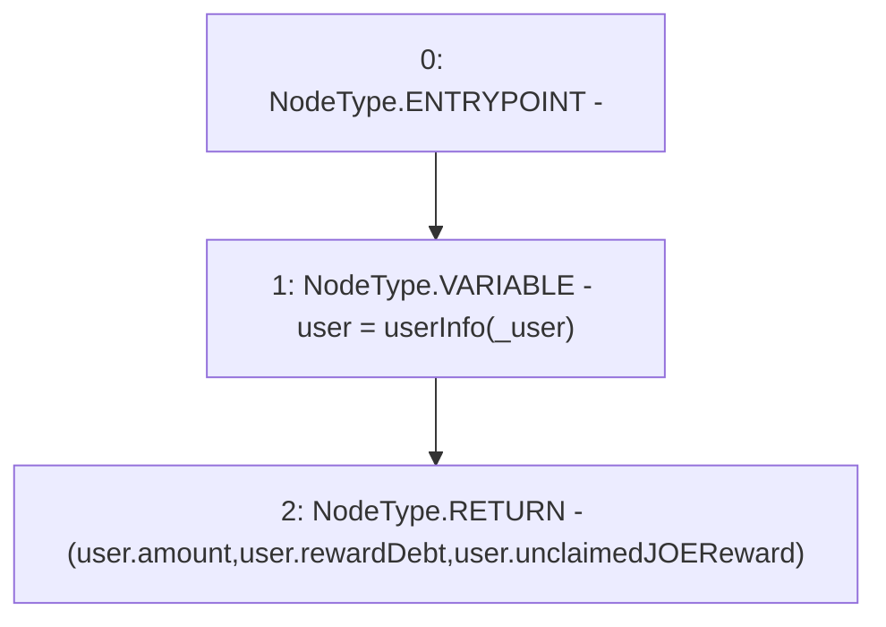

# Context: WJLP.getUserInfo

**Contract:** `WJLP` (Inherits: IWAsset, ERC20_8, IERC20)
**Signature:** `getUserInfo(address) returns (uint256, uint256, uint256)`
**Method Selector ID:** `0x6386c1c7`
**Visibility:** `external`
**Environment-Free:** `Yes`
**Modifiers:** None

### State Variables Interaction
- **Reads:** userInfo
- **Writes:** None

### Environment & Verification Flags
- **Uses Foundry Cheatcodes:** No
- **Has Echidna Properties:** No

### Internal Calls Tree
- None

### External Calls / Value Transfers
- None

### Control Flow Graph (CFG)


### Source Mapping
Declared in: `certora-ac-datasets/detasets/web3bugs/dataset/web3bugs/66/packages/contracts/contracts/AssetWrappers/WJLP.sol` on lines **293** to **296**

```solidity
    function getUserInfo(address _user) external view override returns (uint, uint, uint)  {
        UserInfo memory user = userInfo[_user];
        return (user.amount, user.rewardDebt, user.unclaimedJOEReward);
    }

```
