# Context: WJLP.setAddresses

**Contract:** `WJLP` (Inherits: IWAsset, ERC20_8, IERC20)
**Signature:** `setAddresses(address,address,address,address,address,address,address,address)`
**Method Selector ID:** `0xd733cfd0`
**Visibility:** `external`
**Environment-Free:** `Yes`
**Modifiers:** None

### State Variables Interaction
- **Reads:** addressesSet
- **Writes:** TML, TMR, YetiFinanceTreasury, activePool, addressesSet, borrowerOperations, collSurplusPool, defaultPool, stabilityPool

### Assertion Checks & Business Requirements
- require/assert: `require(bool,string)(! addressesSet,setAddresses: Addresses already set)`

### Environment & Verification Flags
- **Uses Foundry Cheatcodes:** No
- **Has Echidna Properties:** No

### Internal Calls Tree
- None

### External Calls / Value Transfers
- None

### Control Flow Graph (CFG)

```mermaid
flowchart TD
    Node_0["0: NodeType.ENTRYPOINT - "]
    Node_0 --> Node_1
    Node_1["1: NodeType.EXPRESSION - require(bool,string)(! addressesSet,setAddresses: Addresses already set)"]
    Node_1 --> Node_2
    Node_2["2: NodeType.EXPRESSION - checkContract(_activePool)"]
    Node_2 --> Node_3
    Node_3["3: NodeType.EXPRESSION - checkContract(_TML)"]
    Node_3 --> Node_4
    Node_4["4: NodeType.EXPRESSION - checkContract(_TMR)"]
    Node_4 --> Node_5
    Node_5["5: NodeType.EXPRESSION - checkContract(_defaultPool)"]
    Node_5 --> Node_6
    Node_6["6: NodeType.EXPRESSION - checkContract(_stabilityPool)"]
    Node_6 --> Node_7
    Node_7["7: NodeType.EXPRESSION - checkContract(_YetiFinanceTreasury)"]
    Node_7 --> Node_8
    Node_8["8: NodeType.EXPRESSION - checkContract(_borrowerOperations)"]
    Node_8 --> Node_9
    Node_9["9: NodeType.EXPRESSION - checkContract(_collSurplusPool)"]
    Node_9 --> Node_10
    Node_10["10: NodeType.EXPRESSION - activePool = _activePool"]
    Node_10 --> Node_11
    Node_11["11: NodeType.EXPRESSION - TML = _TML"]
    Node_11 --> Node_12
    Node_12["12: NodeType.EXPRESSION - TMR = _TMR"]
    Node_12 --> Node_13
    Node_13["13: NodeType.EXPRESSION - defaultPool = _defaultPool"]
    Node_13 --> Node_14
    Node_14["14: NodeType.EXPRESSION - stabilityPool = _stabilityPool"]
    Node_14 --> Node_15
    Node_15["15: NodeType.EXPRESSION - YetiFinanceTreasury = _YetiFinanceTreasury"]
    Node_15 --> Node_16
    Node_16["16: NodeType.EXPRESSION - borrowerOperations = _borrowerOperations"]
    Node_16 --> Node_17
    Node_17["17: NodeType.EXPRESSION - collSurplusPool = _collSurplusPool"]
    Node_17 --> Node_18
    Node_18["18: NodeType.EXPRESSION - addressesSet = true"]
```


### Source Mapping
Declared in: `certora-ac-datasets/detasets/web3bugs/dataset/web3bugs/66/packages/contracts/contracts/AssetWrappers/WJLP.sol` on lines **106** to **133**

```solidity
    function setAddresses(
        address _activePool,
        address _TML,
        address _TMR,
        address _defaultPool,
        address _stabilityPool,
        address _YetiFinanceTreasury, 
        address _borrowerOperations, 
        address _collSurplusPool) external {
        require(!addressesSet, "setAddresses: Addresses already set");
        checkContract(_activePool);
        checkContract(_TML);
        checkContract(_TMR);
        checkContract(_defaultPool);
        checkContract(_stabilityPool);
        checkContract(_YetiFinanceTreasury);
        checkContract(_borrowerOperations);
        checkContract(_collSurplusPool);
        activePool = _activePool;
        TML = _TML;
        TMR = _TMR;
        defaultPool = _defaultPool;
        stabilityPool = _stabilityPool;
        YetiFinanceTreasury = _YetiFinanceTreasury;
        borrowerOperations = _borrowerOperations;
        collSurplusPool = _collSurplusPool;
        addressesSet = true;
    }

```
