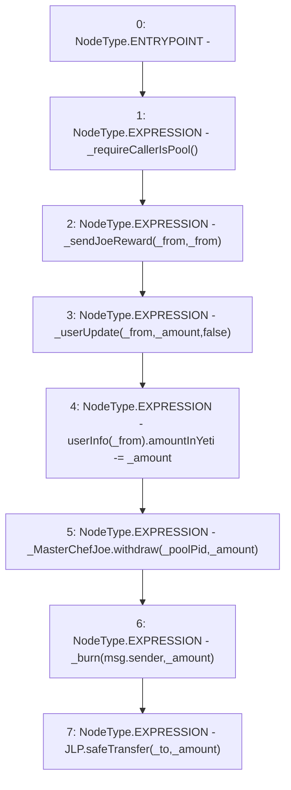

# Context: WJLP.unwrapFor

**Contract:** `WJLP` (Inherits: IWAsset, ERC20_8, IERC20)
**Signature:** `unwrapFor(address,address,uint256)`
**Method Selector ID:** `0x261c80b6`
**Visibility:** `external`
**Environment-Free:** `No (reads EVM state context)`
**Modifiers:** None

### State Variables Interaction
- **Reads:** JLP, _MasterChefJoe, _poolPid, userInfo
- **Writes:** userInfo

### Environment & Verification Flags
- **Uses Foundry Cheatcodes:** No
- **Has Echidna Properties:** No

### Internal Calls Tree
- None

### External Calls / Value Transfers
- `SafeERC20.LIBRARY_CALL, dest:SafeERC20, function:SafeERC20.safeTransfer(IERC20,address,uint256), arguments:['JLP', '_to', '_amount'] `
- `IMasterChefJoeV2.HIGH_LEVEL_CALL, dest:_MasterChefJoe(IMasterChefJoeV2), function:withdraw, arguments:['_poolPid', '_amount']  `

### Control Flow Graph (CFG)


### Source Mapping
Declared in: `certora-ac-datasets/detasets/web3bugs/dataset/web3bugs/66/packages/contracts/contracts/AssetWrappers/WJLP.sol` on lines **224** to **244**

```solidity
    function unwrapFor(address _from, address _to, uint _amount) external override {
        _requireCallerIsPool();

        // Claim pending reward for original owner
        _sendJoeReward(_from, _from);

        // Decrease rewards by the same amount user is unwrapping. Ensures they have enough reward balance. 
        _userUpdate(_from, _amount, false);
        userInfo[_from].amountInYeti -= _amount;

        // Withdraw LP tokens from Master chef contract
        _MasterChefJoe.withdraw(_poolPid, _amount);

        // msg.sender is either Active Pool or Stability Pool
        // each one has the ability to unwrap and burn WAssets they own and
        // send them to someone else
        _burn(msg.sender, _amount);

        // Transfer withdrawn JLP tokens to new owner. 
        JLP.safeTransfer(_to, _amount);
    }

```
