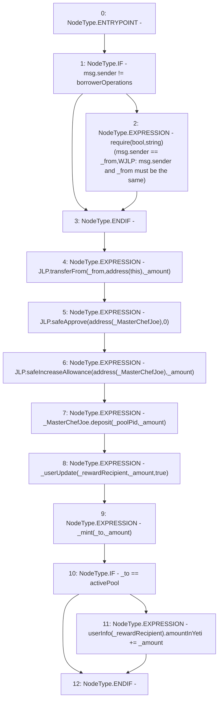

# Context: WJLP.wrap

**Contract:** `WJLP` (Inherits: IWAsset, ERC20_8, IERC20)
**Signature:** `wrap(uint256,address,address,address)`
**Method Selector ID:** `0x932eeefe`
**Visibility:** `external`
**Environment-Free:** `No (reads EVM state context)`
**Modifiers:** None

### State Variables Interaction
- **Reads:** JLP, _MasterChefJoe, _poolPid, activePool, borrowerOperations, userInfo
- **Writes:** userInfo

### Assertion Checks & Business Requirements
- require/assert: `require(bool,string)(msg.sender == _from,WJLP: msg.sender and _from must be the same)`

### Environment & Verification Flags
- **Uses Foundry Cheatcodes:** No
- **Has Echidna Properties:** No

### Internal Calls Tree
- None

### External Calls / Value Transfers
- `TMP_125(None) = SOLIDITY_CALL require(bool,string)(TMP_124,WJLP: msg.sender and _from must be the same)`
- `IERC20.TMP_127(bool) = HIGH_LEVEL_CALL, dest:JLP(IERC20), function:transferFrom, arguments:['_from', 'TMP_126', '_amount']  `
- `SafeERC20.LIBRARY_CALL, dest:SafeERC20, function:SafeERC20.safeApprove(IERC20,address,uint256), arguments:['JLP', 'TMP_128', '0'] `
- `IMasterChefJoeV2.HIGH_LEVEL_CALL, dest:_MasterChefJoe(IMasterChefJoeV2), function:deposit, arguments:['_poolPid', '_amount']  `
- `SafeERC20.LIBRARY_CALL, dest:SafeERC20, function:SafeERC20.safeIncreaseAllowance(IERC20,address,uint256), arguments:['JLP', 'TMP_130', '_amount'] `

### Control Flow Graph (CFG)


### Source Mapping
Declared in: `certora-ac-datasets/detasets/web3bugs/dataset/web3bugs/66/packages/contracts/contracts/AssetWrappers/WJLP.sol` on lines **147** to **170**

```solidity
    function wrap(uint _amount, address _from, address _to, address _rewardRecipient) external override {
        if (msg.sender != borrowerOperations) {
            // Unless the caller is borrower operations, msg.sender and _from cannot 
            // be different. 
            require(msg.sender == _from, "WJLP: msg.sender and _from must be the same");
        }

        JLP.transferFrom(_from, address(this), _amount);

        JLP.safeApprove(address(_MasterChefJoe), 0);
        JLP.safeIncreaseAllowance(address(_MasterChefJoe), _amount);

        // stake LP tokens in Trader Joe's.
        // In process of depositing, all this contract's
        // accumulated JOE rewards are sent into this contract
        _MasterChefJoe.deposit(_poolPid, _amount);

        // update user reward tracking
        _userUpdate(_rewardRecipient, _amount, true);
        _mint(_to, _amount);
        if (_to == activePool) {
            userInfo[_rewardRecipient].amountInYeti += _amount;
        }
    }

```
