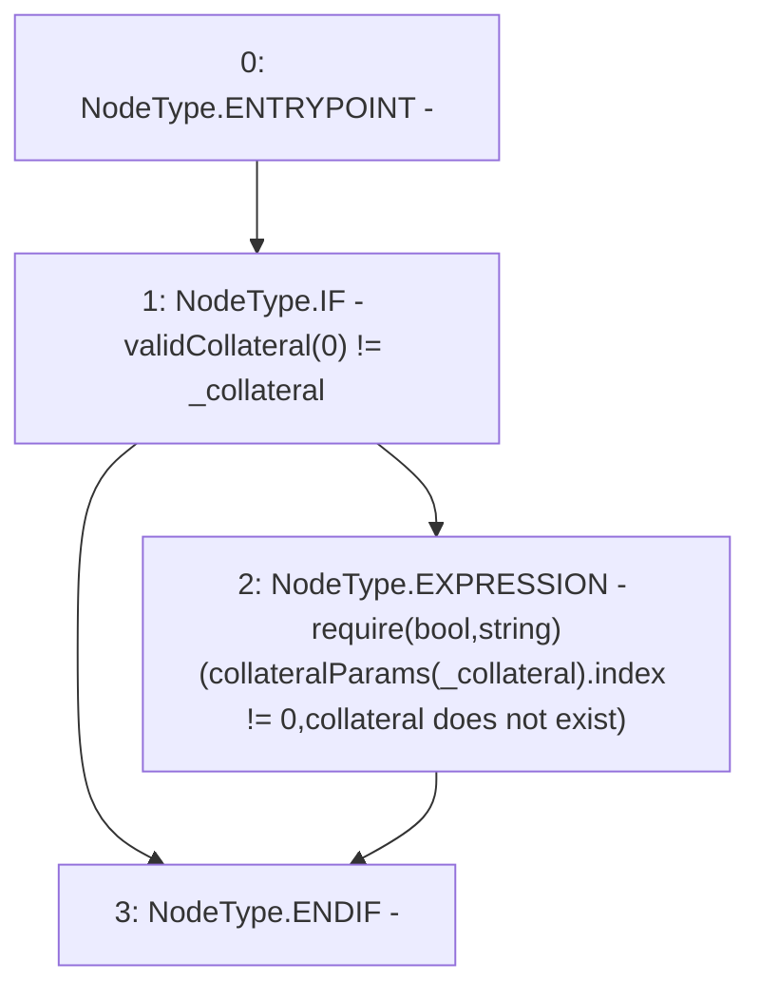

# Context: Whitelist._exists

**Contract:** `Whitelist` (Inherits: CheckContract, IBaseOracle, IWhitelist, Ownable)
**Signature:** `_exists(address)`
**Method Selector ID:** `Internal (No Method ID)`
**Visibility:** `internal`
**Environment-Free:** `Yes`
**Modifiers:** None

### State Variables Interaction
- **Reads:** collateralParams, validCollateral
- **Writes:** None

### Assertion Checks & Business Requirements
- require/assert: `require(bool,string)(collateralParams[_collateral].index != 0,collateral does not exist)`

### Environment & Verification Flags
- **Uses Foundry Cheatcodes:** No
- **Has Echidna Properties:** No

### Internal Calls Tree
- None

### External Calls / Value Transfers
- None

### Control Flow Graph (CFG)


### Source Mapping
Declared in: `certora-ac-datasets/detasets/web3bugs/dataset/web3bugs/66/packages/contracts/contracts/Dependencies/Whitelist.sol` on lines **72** to **76**

```solidity
    function _exists(address _collateral) internal view {
        if (validCollateral[0] != _collateral) {
            require(collateralParams[_collateral].index != 0, "collateral does not exist");
        }
    }

```
