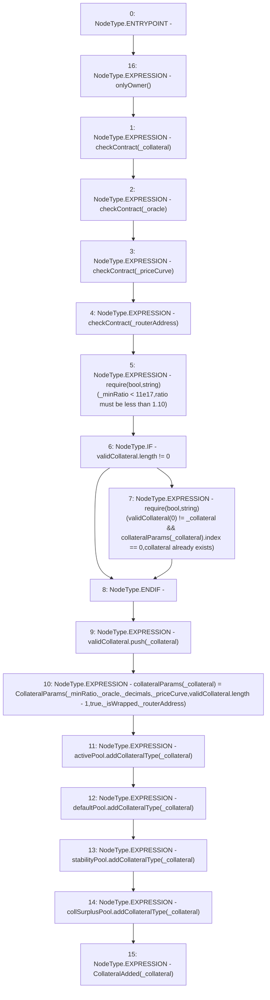

# Context: Whitelist.addCollateral

**Contract:** `Whitelist` (Inherits: CheckContract, IBaseOracle, IWhitelist, Ownable)
**Signature:** `addCollateral(address,uint256,address,uint256,address,bool,address)`
**Method Selector ID:** `0xb56181d6`
**Visibility:** `external`
**Environment-Free:** `No (reads EVM state context)`
**Modifiers:**
- `onlyOwner`
  ```solidity
  modifier onlyOwner() {
          require(isOwner(), "CallerNotOwner");
          _;
      }
  ```

### State Variables Interaction
- **Reads:** activePool, collSurplusPool, collateralParams, defaultPool, stabilityPool, validCollateral
- **Writes:** collateralParams, validCollateral

### Assertion Checks & Business Requirements
- require/assert: `require(bool,string)(_minRatio < 11e17,ratio must be less than 1.10)`
- require/assert: `require(bool,string)(validCollateral[0] != _collateral && collateralParams[_collateral].index == 0,collateral already exists)`

### Environment & Verification Flags
- **Uses Foundry Cheatcodes:** No
- **Has Echidna Properties:** No

### Internal Calls Tree
- None

### External Calls / Value Transfers
- `IDefaultPool.HIGH_LEVEL_CALL, dest:defaultPool(IDefaultPool), function:addCollateralType, arguments:['_collateral']  `
- `IActivePool.HIGH_LEVEL_CALL, dest:activePool(IActivePool), function:addCollateralType, arguments:['_collateral']  `
- `ICollSurplusPool.HIGH_LEVEL_CALL, dest:collSurplusPool(ICollSurplusPool), function:addCollateralType, arguments:['_collateral']  `
- `IStabilityPool.HIGH_LEVEL_CALL, dest:stabilityPool(IStabilityPool), function:addCollateralType, arguments:['_collateral']  `

### Control Flow Graph (CFG)


### Source Mapping
Declared in: `certora-ac-datasets/detasets/web3bugs/dataset/web3bugs/66/packages/contracts/contracts/Dependencies/Whitelist.sol` on lines **102** to **142**

```solidity
    function addCollateral(
        address _collateral,
        uint256 _minRatio,
        address _oracle,
        uint256 _decimals,
        address _priceCurve, 
        bool _isWrapped, 
        address _routerAddress
    ) external onlyOwner {
        checkContract(_collateral);
        checkContract(_oracle);
        checkContract(_priceCurve);
        checkContract(_routerAddress);
        // If collateral list is not 0, and if the 0th index is not equal to this collateral,
        // then if index is 0 that means it is not set yet.
        require(_minRatio < 11e17, "ratio must be less than 1.10"); //=> greater than 1.1 would mean taking out more YUSD than collateral VC

        if (validCollateral.length != 0) {
            require(validCollateral[0] != _collateral && collateralParams[_collateral].index == 0, "collateral already exists");
        }

        validCollateral.push(_collateral);
        collateralParams[_collateral] = CollateralParams(
            _minRatio,
            _oracle,
            _decimals,
            _priceCurve,
            validCollateral.length - 1, 
            true,
            _isWrapped,
            _routerAddress
        );

        activePool.addCollateralType(_collateral);
        defaultPool.addCollateralType(_collateral);
        stabilityPool.addCollateralType(_collateral);
        collSurplusPool.addCollateralType(_collateral);

        // throw event
        emit CollateralAdded(_collateral);
    }

```
