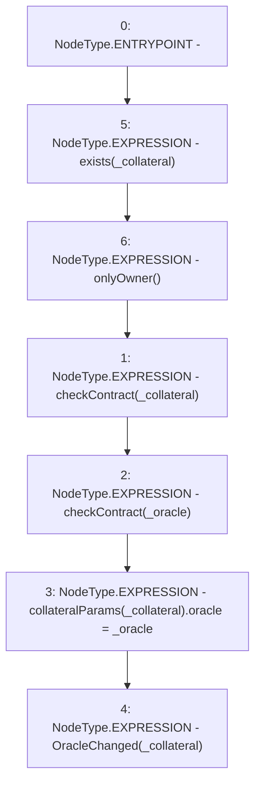

# Context: Whitelist.changeOracle

**Contract:** `Whitelist` (Inherits: CheckContract, IBaseOracle, IWhitelist, Ownable)
**Signature:** `changeOracle(address,address)`
**Method Selector ID:** `0x4dc809ce`
**Visibility:** `external`
**Environment-Free:** `No (reads EVM state context)`
**Modifiers:**
- `exists`
  ```solidity
  modifier exists(address _collateral) {
          _exists(_collateral);
          _;
      }
  ```
- `onlyOwner`
  ```solidity
  modifier onlyOwner() {
          require(isOwner(), "CallerNotOwner");
          _;
      }
  ```

### State Variables Interaction
- **Reads:** collateralParams
- **Writes:** collateralParams

### Environment & Verification Flags
- **Uses Foundry Cheatcodes:** No
- **Has Echidna Properties:** No

### Internal Calls Tree
- None

### External Calls / Value Transfers
- None

### Control Flow Graph (CFG)


### Source Mapping
Declared in: `certora-ac-datasets/detasets/web3bugs/dataset/web3bugs/66/packages/contracts/contracts/Dependencies/Whitelist.sol` on lines **177** to **188**

```solidity
    function changeOracle(address _collateral, address _oracle)
        external
        exists(_collateral)
        onlyOwner
    {
        checkContract(_collateral);
        checkContract(_oracle);
        collateralParams[_collateral].oracle = _oracle;

        // throw event
        emit OracleChanged(_collateral);
    }

```
