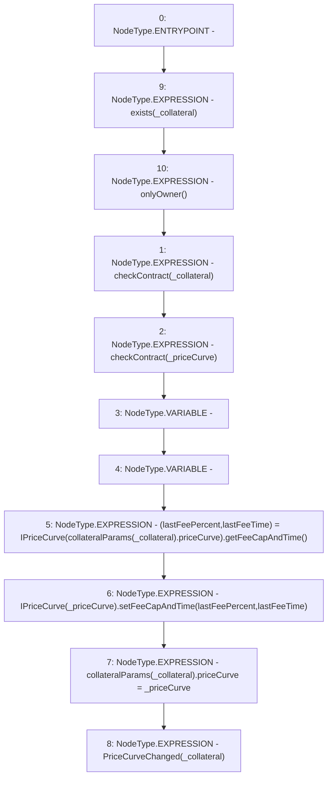

# Context: Whitelist.changePriceCurve

**Contract:** `Whitelist` (Inherits: CheckContract, IBaseOracle, IWhitelist, Ownable)
**Signature:** `changePriceCurve(address,address)`
**Method Selector ID:** `0x7d26a269`
**Visibility:** `external`
**Environment-Free:** `No (reads EVM state context)`
**Modifiers:**
- `exists`
  ```solidity
  modifier exists(address _collateral) {
          _exists(_collateral);
          _;
      }
  ```
- `onlyOwner`
  ```solidity
  modifier onlyOwner() {
          require(isOwner(), "CallerNotOwner");
          _;
      }
  ```

### State Variables Interaction
- **Reads:** collateralParams
- **Writes:** collateralParams

### Environment & Verification Flags
- **Uses Foundry Cheatcodes:** No
- **Has Echidna Properties:** No

### Internal Calls Tree
- None

### External Calls / Value Transfers
- `IPriceCurve.HIGH_LEVEL_CALL, dest:TMP_332(IPriceCurve), function:setFeeCapAndTime, arguments:['lastFeePercent', 'lastFeeTime']  `
- `IPriceCurve.TUPLE_0(uint256,uint256) = HIGH_LEVEL_CALL, dest:TMP_331(IPriceCurve), function:getFeeCapAndTime, arguments:[]  `

### Control Flow Graph (CFG)


### Source Mapping
Declared in: `certora-ac-datasets/detasets/web3bugs/dataset/web3bugs/66/packages/contracts/contracts/Dependencies/Whitelist.sol` on lines **193** to **208**

```solidity
    function changePriceCurve(address _collateral, address _priceCurve)
        external
        exists(_collateral)
        onlyOwner
    {
        checkContract(_collateral);
        checkContract(_priceCurve);
        uint lastFeePercent;
        uint lastFeeTime; 
        (lastFeePercent, lastFeeTime) = IPriceCurve(collateralParams[_collateral].priceCurve).getFeeCapAndTime();
        IPriceCurve(_priceCurve).setFeeCapAndTime(lastFeePercent, lastFeeTime);
        collateralParams[_collateral].priceCurve = _priceCurve;

        // throw event
        emit PriceCurveChanged(_collateral);
    }

```
