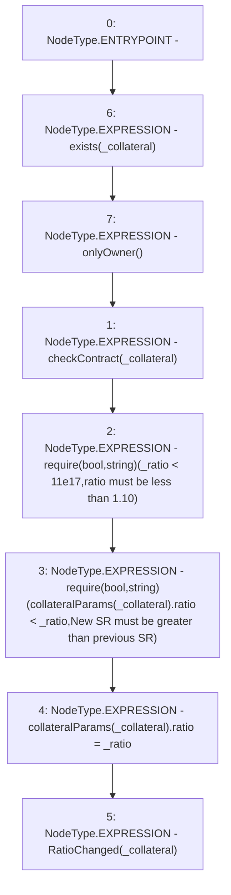

# Context: Whitelist.changeRatio

**Contract:** `Whitelist` (Inherits: CheckContract, IBaseOracle, IWhitelist, Ownable)
**Signature:** `changeRatio(address,uint256)`
**Method Selector ID:** `0x6ae29402`
**Visibility:** `external`
**Environment-Free:** `No (reads EVM state context)`
**Modifiers:**
- `exists`
  ```solidity
  modifier exists(address _collateral) {
          _exists(_collateral);
          _;
      }
  ```
- `onlyOwner`
  ```solidity
  modifier onlyOwner() {
          require(isOwner(), "CallerNotOwner");
          _;
      }
  ```

### State Variables Interaction
- **Reads:** collateralParams
- **Writes:** collateralParams

### Assertion Checks & Business Requirements
- require/assert: `require(bool,string)(_ratio < 11e17,ratio must be less than 1.10)`
- require/assert: `require(bool,string)(collateralParams[_collateral].ratio < _ratio,New SR must be greater than previous SR)`

### Environment & Verification Flags
- **Uses Foundry Cheatcodes:** No
- **Has Echidna Properties:** No

### Internal Calls Tree
- None

### External Calls / Value Transfers
- None

### Control Flow Graph (CFG)


### Source Mapping
Declared in: `certora-ac-datasets/detasets/web3bugs/dataset/web3bugs/66/packages/contracts/contracts/Dependencies/Whitelist.sol` on lines **213** to **225**

```solidity
    function changeRatio(address _collateral, uint256 _ratio)
        external
        exists(_collateral)
        onlyOwner
    {
        checkContract(_collateral);
        require(_ratio < 11e17, "ratio must be less than 1.10"); //=> greater than 1.1 would mean taking out more YUSD than collateral VC
        require(collateralParams[_collateral].ratio < _ratio, "New SR must be greater than previous SR");
        collateralParams[_collateral].ratio = _ratio;

        // throw event
        emit RatioChanged(_collateral);
    }

```
