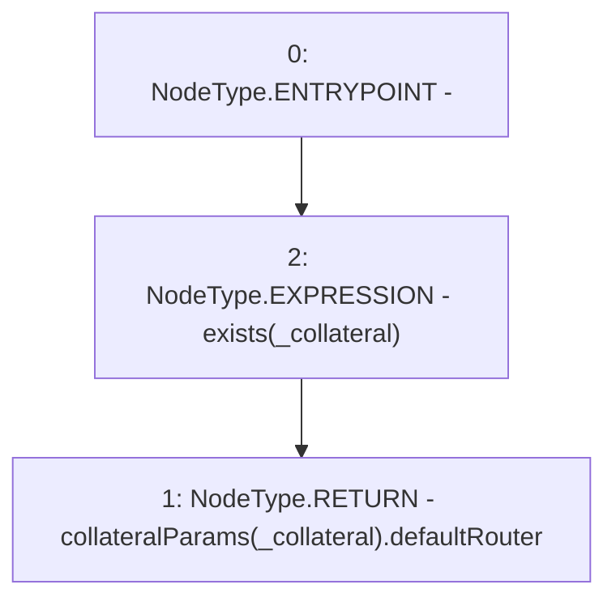

# Context: Whitelist.getDefaultRouterAddress

**Contract:** `Whitelist` (Inherits: CheckContract, IBaseOracle, IWhitelist, Ownable)
**Signature:** `getDefaultRouterAddress(address) returns (address)`
**Method Selector ID:** `0x3b667865`
**Visibility:** `external`
**Environment-Free:** `Yes`
**Modifiers:**
- `exists`
  ```solidity
  modifier exists(address _collateral) {
          _exists(_collateral);
          _;
      }
  ```

### State Variables Interaction
- **Reads:** collateralParams
- **Writes:** None

### Environment & Verification Flags
- **Uses Foundry Cheatcodes:** No
- **Has Echidna Properties:** No

### Internal Calls Tree
- None

### External Calls / Value Transfers
- None

### Control Flow Graph (CFG)


### Source Mapping
Declared in: `certora-ac-datasets/detasets/web3bugs/dataset/web3bugs/66/packages/contracts/contracts/Dependencies/Whitelist.sol` on lines **234** to **236**

```solidity
    function getDefaultRouterAddress(address _collateral) external view override exists(_collateral) returns (address) {
        return collateralParams[_collateral].defaultRouter;
    }

```
