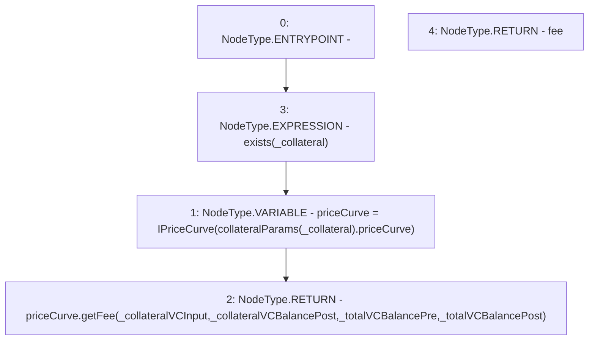

# Context: Whitelist.getFee

**Contract:** `Whitelist` (Inherits: CheckContract, IBaseOracle, IWhitelist, Ownable)
**Signature:** `getFee(address,uint256,uint256,uint256,uint256) returns (uint256)`
**Method Selector ID:** `0x885db070`
**Visibility:** `external`
**Environment-Free:** `Yes`
**Modifiers:**
- `exists`
  ```solidity
  modifier exists(address _collateral) {
          _exists(_collateral);
          _;
      }
  ```

### State Variables Interaction
- **Reads:** collateralParams
- **Writes:** None

### Environment & Verification Flags
- **Uses Foundry Cheatcodes:** No
- **Has Echidna Properties:** No

### Internal Calls Tree
- None

### External Calls / Value Transfers
- `IPriceCurve.TMP_356(uint256) = HIGH_LEVEL_CALL, dest:priceCurve(IPriceCurve), function:getFee, arguments:['_collateralVCInput', '_collateralVCBalancePost', '_totalVCBalancePre', '_totalVCBalancePost']  `

### Control Flow Graph (CFG)


### Source Mapping
Declared in: `certora-ac-datasets/detasets/web3bugs/dataset/web3bugs/66/packages/contracts/contracts/Dependencies/Whitelist.sol` on lines **315** to **324**

```solidity
    function getFee(
        address _collateral,
        uint256 _collateralVCInput,
        uint256 _collateralVCBalancePost,
        uint256 _totalVCBalancePre,
        uint256 _totalVCBalancePost
    ) external view override exists(_collateral) returns (uint256 fee) {
        IPriceCurve priceCurve = IPriceCurve(collateralParams[_collateral].priceCurve);
        return priceCurve.getFee(_collateralVCInput, _collateralVCBalancePost, _totalVCBalancePre, _totalVCBalancePost);
    }

```
