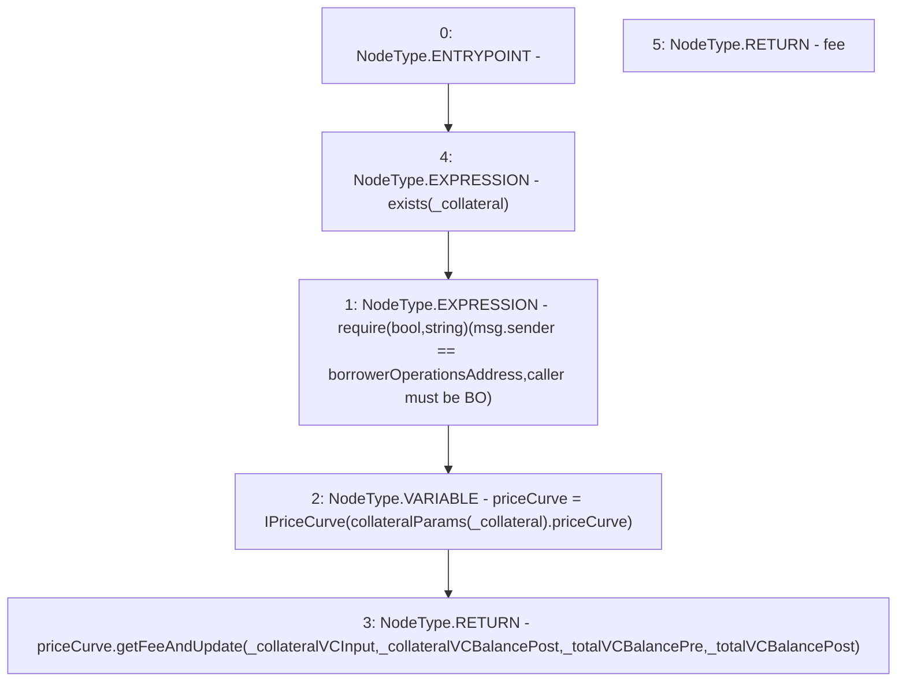

# Context: Whitelist.getFeeAndUpdate

**Contract:** `Whitelist` (Inherits: CheckContract, IBaseOracle, IWhitelist, Ownable)
**Signature:** `getFeeAndUpdate(address,uint256,uint256,uint256,uint256) returns (uint256)`
**Method Selector ID:** `0x8d3f8298`
**Visibility:** `external`
**Environment-Free:** `No (reads EVM state context)`
**Modifiers:**
- `exists`
  ```solidity
  modifier exists(address _collateral) {
          _exists(_collateral);
          _;
      }
  ```

### State Variables Interaction
- **Reads:** borrowerOperationsAddress, collateralParams
- **Writes:** None

### Assertion Checks & Business Requirements
- require/assert: `require(bool,string)(msg.sender == borrowerOperationsAddress,caller must be BO)`

### Environment & Verification Flags
- **Uses Foundry Cheatcodes:** No
- **Has Echidna Properties:** No

### Internal Calls Tree
- None

### External Calls / Value Transfers
- `IPriceCurve.TMP_361(uint256) = HIGH_LEVEL_CALL, dest:priceCurve(IPriceCurve), function:getFeeAndUpdate, arguments:['_collateralVCInput', '_collateralVCBalancePost', '_totalVCBalancePre', '_totalVCBalancePost']  `

### Control Flow Graph (CFG)


### Source Mapping
Declared in: `certora-ac-datasets/detasets/web3bugs/dataset/web3bugs/66/packages/contracts/contracts/Dependencies/Whitelist.sol` on lines **327** to **346**

```solidity
    function getFeeAndUpdate(
        address _collateral,
        uint256 _collateralVCInput,
        uint256 _collateralVCBalancePost,
        uint256 _totalVCBalancePre,
        uint256 _totalVCBalancePost
    ) external override exists(_collateral) returns (uint256 fee) {
        require(
            msg.sender == borrowerOperationsAddress,
            "caller must be BO"
        );
        IPriceCurve priceCurve = IPriceCurve(collateralParams[_collateral].priceCurve);
        return
            priceCurve.getFeeAndUpdate(
                _collateralVCInput,
                _collateralVCBalancePost,
                _totalVCBalancePre,
                _totalVCBalancePost
            );
    }

```
