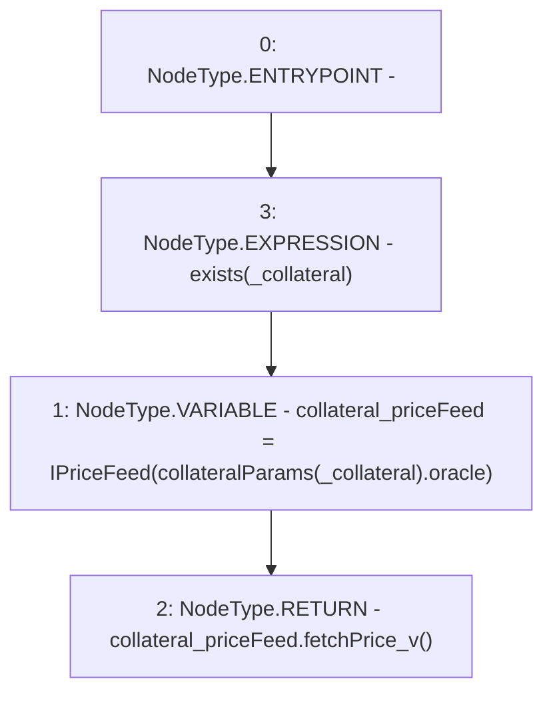

# Context: Whitelist.getPrice

**Contract:** `Whitelist` (Inherits: CheckContract, IBaseOracle, IWhitelist, Ownable)
**Signature:** `getPrice(address) returns (uint256)`
**Method Selector ID:** `0x41976e09`
**Visibility:** `public`
**Environment-Free:** `Yes`
**Modifiers:**
- `exists`
  ```solidity
  modifier exists(address _collateral) {
          _exists(_collateral);
          _;
      }
  ```

### State Variables Interaction
- **Reads:** collateralParams
- **Writes:** None

### Environment & Verification Flags
- **Uses Foundry Cheatcodes:** No
- **Has Echidna Properties:** No

### Internal Calls Tree
- None

### External Calls / Value Transfers
- `IPriceFeed.TMP_364(uint256) = HIGH_LEVEL_CALL, dest:collateral_priceFeed(IPriceFeed), function:fetchPrice_v, arguments:[]  `

### Control Flow Graph (CFG)


### Source Mapping
Declared in: `certora-ac-datasets/detasets/web3bugs/dataset/web3bugs/66/packages/contracts/contracts/Dependencies/Whitelist.sol` on lines **349** to **358**

```solidity
    function getPrice(address _collateral)
        public
        view
        override
        exists(_collateral)
        returns (uint256)
    {
        IPriceFeed collateral_priceFeed = IPriceFeed(collateralParams[_collateral].oracle);
        return collateral_priceFeed.fetchPrice_v();
    }

```
