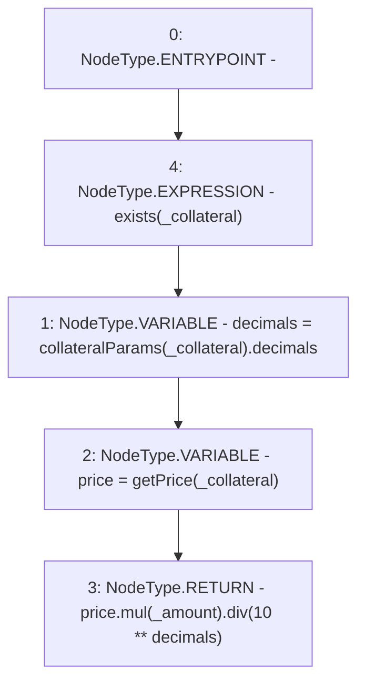

# Context: Whitelist.getValueUSD

**Contract:** `Whitelist` (Inherits: CheckContract, IBaseOracle, IWhitelist, Ownable)
**Signature:** `getValueUSD(address,uint256) returns (uint256)`
**Method Selector ID:** `0xcacabd27`
**Visibility:** `external`
**Environment-Free:** `Yes`
**Modifiers:**
- `exists`
  ```solidity
  modifier exists(address _collateral) {
          _exists(_collateral);
          _;
      }
  ```

### State Variables Interaction
- **Reads:** collateralParams
- **Writes:** None

### Environment & Verification Flags
- **Uses Foundry Cheatcodes:** No
- **Has Echidna Properties:** No

### Internal Calls Tree
- None

### External Calls / Value Transfers
- `SafeMath.TMP_367(uint256) = LIBRARY_CALL, dest:SafeMath, function:SafeMath.mul(uint256,uint256), arguments:['price', '_amount'] `
- `SafeMath.TMP_369(uint256) = LIBRARY_CALL, dest:SafeMath, function:SafeMath.div(uint256,uint256), arguments:['TMP_367', 'TMP_368'] `

### Control Flow Graph (CFG)


### Source Mapping
Declared in: `certora-ac-datasets/detasets/web3bugs/dataset/web3bugs/66/packages/contracts/contracts/Dependencies/Whitelist.sol` on lines **361** to **371**

```solidity
    function getValueUSD(address _collateral, uint256 _amount)
        external
        view
        override
        exists(_collateral)
        returns (uint256)
    {
        uint256 decimals = collateralParams[_collateral].decimals;
        uint256 price = getPrice(_collateral);
        return price.mul(_amount).div(10**decimals);
    }

```
