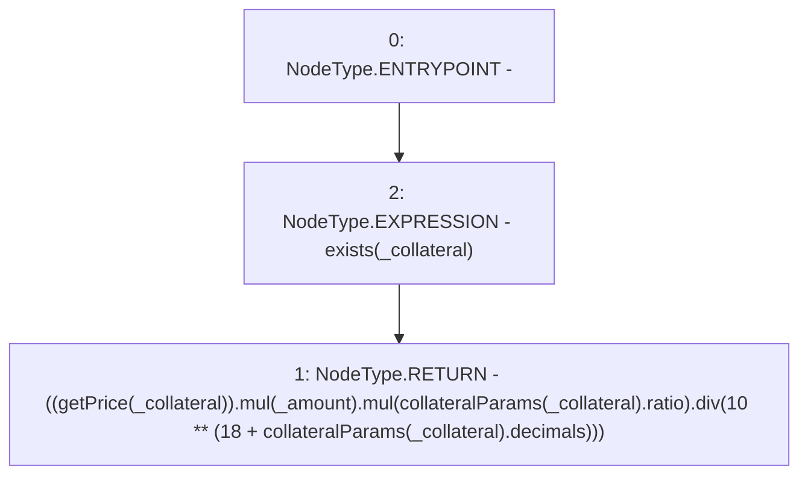

# Context: Whitelist.getValueVC

**Contract:** `Whitelist` (Inherits: CheckContract, IBaseOracle, IWhitelist, Ownable)
**Signature:** `getValueVC(address,uint256) returns (uint256)`
**Method Selector ID:** `0x2e2b1a88`
**Visibility:** `external`
**Environment-Free:** `Yes`
**Modifiers:**
- `exists`
  ```solidity
  modifier exists(address _collateral) {
          _exists(_collateral);
          _;
      }
  ```

### State Variables Interaction
- **Reads:** collateralParams
- **Writes:** None

### Environment & Verification Flags
- **Uses Foundry Cheatcodes:** No
- **Has Echidna Properties:** No

### Internal Calls Tree
- None

### External Calls / Value Transfers
- `SafeMath.TMP_376(uint256) = LIBRARY_CALL, dest:SafeMath, function:SafeMath.div(uint256,uint256), arguments:['TMP_373', 'TMP_375'] `
- `SafeMath.TMP_372(uint256) = LIBRARY_CALL, dest:SafeMath, function:SafeMath.mul(uint256,uint256), arguments:['TMP_371', '_amount'] `
- `SafeMath.TMP_373(uint256) = LIBRARY_CALL, dest:SafeMath, function:SafeMath.mul(uint256,uint256), arguments:['TMP_372', 'REF_364'] `

### Control Flow Graph (CFG)


### Source Mapping
Declared in: `certora-ac-datasets/detasets/web3bugs/dataset/web3bugs/66/packages/contracts/contracts/Dependencies/Whitelist.sol` on lines **374** to **390**

```solidity
    function getValueVC(address _collateral, uint256 _amount)
        external
        view
        override
        exists(_collateral)
        returns (uint256)
    {
        // uint256 price = getPrice(_collateral);
        // uint256 decimals = collateralParams[_collateral].decimals;
        // uint256 ratio = collateralParams[_collateral].ratio;
        // return (price.mul(_amount).mul(ratio).div(10**(18 + decimals)));

        // div by 10**18 for price adjustment
        // and divide by 10 ** decimals for decimal adjustment
        // do inline since this function is called often
        return ((getPrice(_collateral)).mul(_amount).mul(collateralParams[_collateral].ratio).div(10**(18 + collateralParams[_collateral].decimals)));
    }

```
