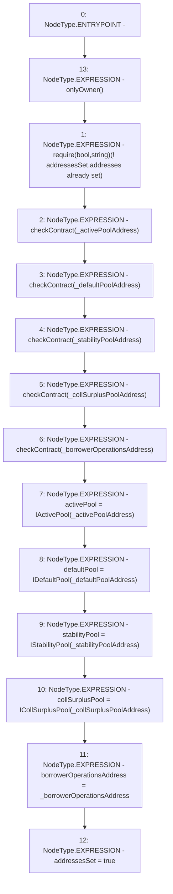

# Context: Whitelist.setAddresses

**Contract:** `Whitelist` (Inherits: CheckContract, IBaseOracle, IWhitelist, Ownable)
**Signature:** `setAddresses(address,address,address,address,address)`
**Method Selector ID:** `0x5dd68acd`
**Visibility:** `external`
**Environment-Free:** `No (reads EVM state context)`
**Modifiers:**
- `onlyOwner`
  ```solidity
  modifier onlyOwner() {
          require(isOwner(), "CallerNotOwner");
          _;
      }
  ```

### State Variables Interaction
- **Reads:** addressesSet
- **Writes:** activePool, addressesSet, borrowerOperationsAddress, collSurplusPool, defaultPool, stabilityPool

### Assertion Checks & Business Requirements
- require/assert: `require(bool,string)(! addressesSet,addresses already set)`

### Environment & Verification Flags
- **Uses Foundry Cheatcodes:** No
- **Has Echidna Properties:** No

### Internal Calls Tree
- None

### External Calls / Value Transfers
- None

### Control Flow Graph (CFG)


### Source Mapping
Declared in: `certora-ac-datasets/detasets/web3bugs/dataset/web3bugs/66/packages/contracts/contracts/Dependencies/Whitelist.sol` on lines **80** to **100**

```solidity
    function setAddresses(
        address _activePoolAddress,
        address _defaultPoolAddress,
        address _stabilityPoolAddress,
        address _collSurplusPoolAddress,
        address _borrowerOperationsAddress
    ) external override onlyOwner {
        require(!addressesSet, "addresses already set");
        checkContract(_activePoolAddress);
        checkContract(_defaultPoolAddress);
        checkContract(_stabilityPoolAddress);
        checkContract(_collSurplusPoolAddress);
        checkContract(_borrowerOperationsAddress);

        activePool = IActivePool(_activePoolAddress);
        defaultPool = IDefaultPool(_defaultPoolAddress);
        stabilityPool = IStabilityPool(_stabilityPoolAddress);
        collSurplusPool = ICollSurplusPool(_collSurplusPoolAddress);
        borrowerOperationsAddress = _borrowerOperationsAddress;
        addressesSet = true;
    }

```
