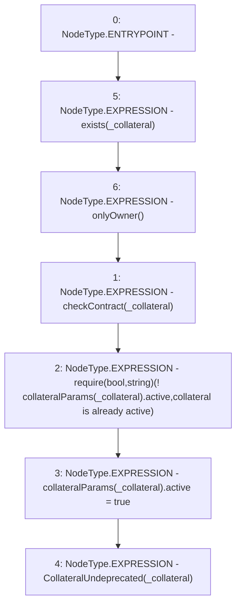

# Context: Whitelist.undeprecateCollateral

**Contract:** `Whitelist` (Inherits: CheckContract, IBaseOracle, IWhitelist, Ownable)
**Signature:** `undeprecateCollateral(address)`
**Method Selector ID:** `0x74b472ba`
**Visibility:** `external`
**Environment-Free:** `No (reads EVM state context)`
**Modifiers:**
- `exists`
  ```solidity
  modifier exists(address _collateral) {
          _exists(_collateral);
          _;
      }
  ```
- `onlyOwner`
  ```solidity
  modifier onlyOwner() {
          require(isOwner(), "CallerNotOwner");
          _;
      }
  ```

### State Variables Interaction
- **Reads:** collateralParams
- **Writes:** collateralParams

### Assertion Checks & Business Requirements
- require/assert: `require(bool,string)(! collateralParams[_collateral].active,collateral is already active)`

### Environment & Verification Flags
- **Uses Foundry Cheatcodes:** No
- **Has Echidna Properties:** No

### Internal Calls Tree
- None

### External Calls / Value Transfers
- None

### Control Flow Graph (CFG)


### Source Mapping
Declared in: `certora-ac-datasets/detasets/web3bugs/dataset/web3bugs/66/packages/contracts/contracts/Dependencies/Whitelist.sol` on lines **163** to **172**

```solidity
    function undeprecateCollateral(address _collateral) external exists(_collateral) onlyOwner {
        checkContract(_collateral);

        require(!collateralParams[_collateral].active, "collateral is already active");

        collateralParams[_collateral].active = true;

        // throw event
        emit CollateralUndeprecated(_collateral);
    }

```
