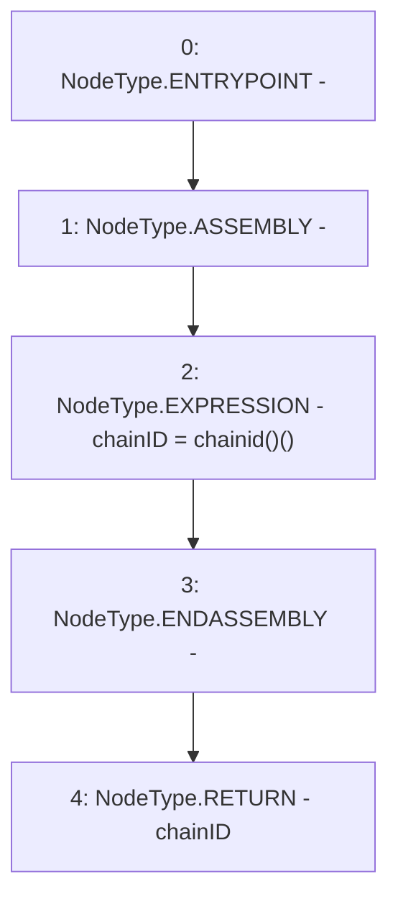

# Context: YETITokenTester._chainID

**Contract:** `YETITokenTester` (Inherits: YETIToken, IYETIToken, IERC2612, IERC20)
**Signature:** `_chainID() returns (uint256)`
**Method Selector ID:** `Internal (No Method ID)`
**Visibility:** `private`
**Environment-Free:** `Yes`
**Modifiers:** None

### State Variables Interaction
- **Reads:** None
- **Writes:** None

### Environment & Verification Flags
- **Uses Foundry Cheatcodes:** No
- **Has Echidna Properties:** No

### Internal Calls Tree
- None

### External Calls / Value Transfers
- None

### Control Flow Graph (CFG)


### Source Mapping
Declared in: `certora-ac-datasets/detasets/web3bugs/dataset/web3bugs/66/packages/contracts/contracts/YETI/YETIToken.sol` on lines **188** to **192**

```solidity
    function _chainID() private pure returns (uint256 chainID) {
        assembly {
            chainID := chainid()
        }
    }

```
