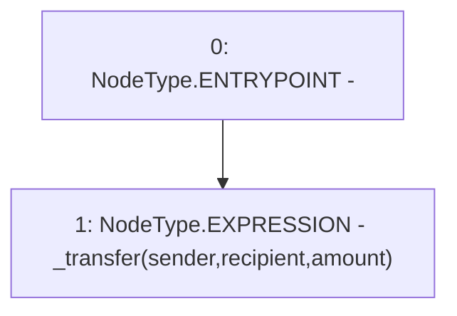

# Context: YETITokenTester.callInternalTransfer

**Contract:** `YETITokenTester` (Inherits: YETIToken, IYETIToken, IERC2612, IERC20)
**Signature:** `callInternalTransfer(address,address,uint256) returns (bool)`
**Method Selector ID:** `0x387a54d9`
**Visibility:** `external`
**Environment-Free:** `Yes`
**Modifiers:** None

### State Variables Interaction
- **Reads:** None
- **Writes:** None

### Environment & Verification Flags
- **Uses Foundry Cheatcodes:** No
- **Has Echidna Properties:** No

### Internal Calls Tree
- None

### External Calls / Value Transfers
- None

### Control Flow Graph (CFG)


### Source Mapping
Declared in: `certora-ac-datasets/detasets/web3bugs/dataset/web3bugs/66/packages/contracts/contracts/TestContracts/YETITokenTester.sol` on lines **37** to **39**

```solidity
    function callInternalTransfer(address sender, address recipient, uint256 amount) external returns (bool) {
        _transfer(sender, recipient, amount);
    }

```
