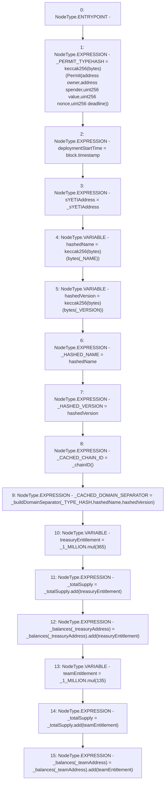

# Context: YETITokenTester.constructor

**Contract:** `YETITokenTester` (Inherits: YETIToken, IYETIToken, IERC2612, IERC20)
**Signature:** `constructor(address,address,address)`
**Method Selector ID:** `0x6dd23b5b`
**Visibility:** `public`
**Environment-Free:** `No (reads EVM state context)`
**Modifiers:** None

### State Variables Interaction
- **Reads:** _1_MILLION, _NAME, _TYPE_HASH, _VERSION, _balances, _totalSupply
- **Writes:** _CACHED_CHAIN_ID, _CACHED_DOMAIN_SEPARATOR, _HASHED_NAME, _HASHED_VERSION, _PERMIT_TYPEHASH, _balances, _totalSupply, deploymentStartTime, sYETIAddress

### Environment & Verification Flags
- **Uses Foundry Cheatcodes:** No
- **Has Echidna Properties:** No

### Internal Calls Tree
- None

### External Calls / Value Transfers
- `SafeMath.TMP_27(uint256) = LIBRARY_CALL, dest:SafeMath, function:SafeMath.mul(uint256,uint256), arguments:['_1_MILLION', '365'] `
- `SafeMath.TMP_28(uint256) = LIBRARY_CALL, dest:SafeMath, function:SafeMath.add(uint256,uint256), arguments:['_totalSupply', 'treasuryEntitlement'] `
- `SafeMath.TMP_30(uint256) = LIBRARY_CALL, dest:SafeMath, function:SafeMath.mul(uint256,uint256), arguments:['_1_MILLION', '135'] `
- `SafeMath.TMP_32(uint256) = LIBRARY_CALL, dest:SafeMath, function:SafeMath.add(uint256,uint256), arguments:['REF_8', 'teamEntitlement'] `
- `SafeMath.TMP_31(uint256) = LIBRARY_CALL, dest:SafeMath, function:SafeMath.add(uint256,uint256), arguments:['_totalSupply', 'teamEntitlement'] `
- `SafeMath.TMP_29(uint256) = LIBRARY_CALL, dest:SafeMath, function:SafeMath.add(uint256,uint256), arguments:['REF_3', 'treasuryEntitlement'] `

### Control Flow Graph (CFG)


### Source Mapping
Declared in: `certora-ac-datasets/detasets/web3bugs/dataset/web3bugs/66/packages/contracts/contracts/YETI/YETIToken.sol` on lines **75** to **107**

```solidity
    constructor
    (
        address _sYETIAddress,
        address _treasuryAddress,
        address _teamAddress
    )
    public
    {
        _PERMIT_TYPEHASH = keccak256("Permit(address owner,address spender,uint256 value,uint256 nonce,uint256 deadline)");
        deploymentStartTime  = block.timestamp;

        sYETIAddress = _sYETIAddress;

        bytes32 hashedName = keccak256(bytes(_NAME));
        bytes32 hashedVersion = keccak256(bytes(_VERSION));

        _HASHED_NAME = hashedName;
        _HASHED_VERSION = hashedVersion;
        _CACHED_CHAIN_ID = _chainID();
        _CACHED_DOMAIN_SEPARATOR = _buildDomainSeparator(_TYPE_HASH, hashedName, hashedVersion);

        // --- Initial YETI allocations ---

        // Allocate 365 million for Yeti Finance Treasury
        uint treasuryEntitlement = _1_MILLION.mul(365);
        _totalSupply = _totalSupply.add(treasuryEntitlement);
        _balances[_treasuryAddress] = _balances[_treasuryAddress].add(treasuryEntitlement);

        // Allocate 135 million for Yeti Finance Team
        uint teamEntitlement = _1_MILLION.mul(135);
        _totalSupply = _totalSupply.add(teamEntitlement);
        _balances[_teamAddress] = _balances[_teamAddress].add(teamEntitlement);
    }

```
