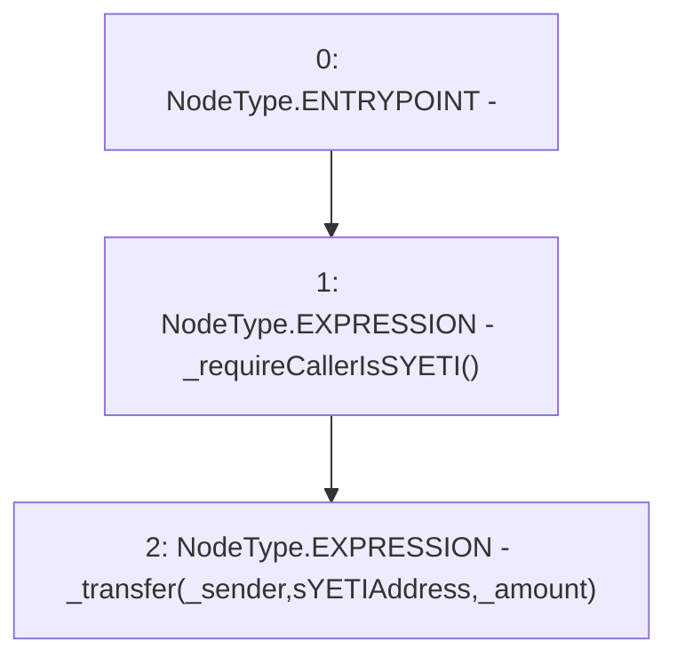

# Context: YETITokenTester.sendToSYETI

**Contract:** `YETITokenTester` (Inherits: YETIToken, IYETIToken, IERC2612, IERC20)
**Signature:** `sendToSYETI(address,uint256)`
**Method Selector ID:** `0xf1be695e`
**Visibility:** `external`
**Environment-Free:** `No (reads EVM state context)`
**Modifiers:** None

### State Variables Interaction
- **Reads:** sYETIAddress
- **Writes:** None

### Environment & Verification Flags
- **Uses Foundry Cheatcodes:** No
- **Has Echidna Properties:** No

### Internal Calls Tree
- None

### External Calls / Value Transfers
- None

### Control Flow Graph (CFG)


### Source Mapping
Declared in: `certora-ac-datasets/detasets/web3bugs/dataset/web3bugs/66/packages/contracts/contracts/YETI/YETIToken.sol` on lines **142** to **145**

```solidity
    function sendToSYETI(address _sender, uint256 _amount) external override {
        _requireCallerIsSYETI();
        _transfer(_sender, sYETIAddress, _amount);
    }

```
