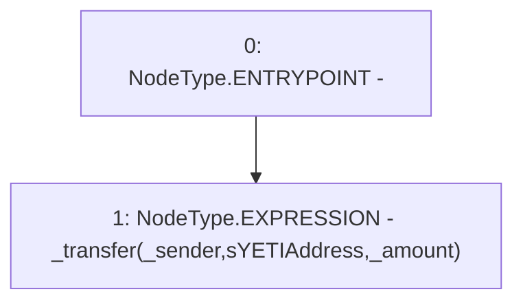

# Context: YETITokenTester.unprotectedSendToSYETI

**Contract:** `YETITokenTester` (Inherits: YETIToken, IYETIToken, IERC2612, IERC20)
**Signature:** `unprotectedSendToSYETI(address,uint256)`
**Method Selector ID:** `0x46501ed8`
**Visibility:** `external`
**Environment-Free:** `Yes`
**Modifiers:** None

### State Variables Interaction
- **Reads:** sYETIAddress
- **Writes:** None

### Environment & Verification Flags
- **Uses Foundry Cheatcodes:** No
- **Has Echidna Properties:** No

### Internal Calls Tree
- None

### External Calls / Value Transfers
- None

### Control Flow Graph (CFG)


### Source Mapping
Declared in: `certora-ac-datasets/detasets/web3bugs/dataset/web3bugs/66/packages/contracts/contracts/TestContracts/YETITokenTester.sol` on lines **29** to **31**

```solidity
    function unprotectedSendToSYETI(address _sender, uint256 _amount) external {
        _transfer(_sender, sYETIAddress, _amount);
    }

```
