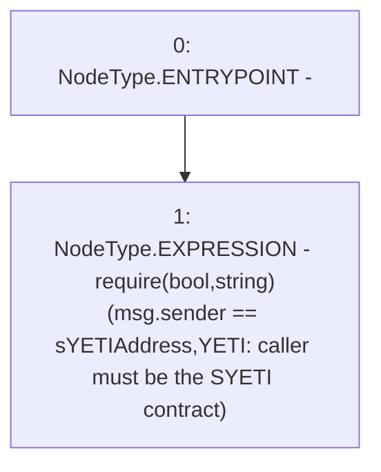

# Context: YETIToken._requireCallerIsSYETI

**Contract:** `YETIToken` (Inherits: IYETIToken, IERC2612, IERC20)
**Signature:** `_requireCallerIsSYETI()`
**Method Selector ID:** `Internal (No Method ID)`
**Visibility:** `internal`
**Environment-Free:** `No (reads EVM state context)`
**Modifiers:** None

### State Variables Interaction
- **Reads:** sYETIAddress
- **Writes:** None

### Assertion Checks & Business Requirements
- require/assert: `require(bool,string)(msg.sender == sYETIAddress,YETI: caller must be the SYETI contract)`

### Environment & Verification Flags
- **Uses Foundry Cheatcodes:** No
- **Has Echidna Properties:** No

### Internal Calls Tree
- None

### External Calls / Value Transfers
- None

### Control Flow Graph (CFG)


### Source Mapping
Declared in: `certora-ac-datasets/detasets/web3bugs/dataset/web3bugs/66/packages/contracts/contracts/YETI/YETIToken.sol` on lines **222** to **224**

```solidity
    function _requireCallerIsSYETI() internal view {
        require(msg.sender == sYETIAddress, "YETI: caller must be the SYETI contract");
    }

```
