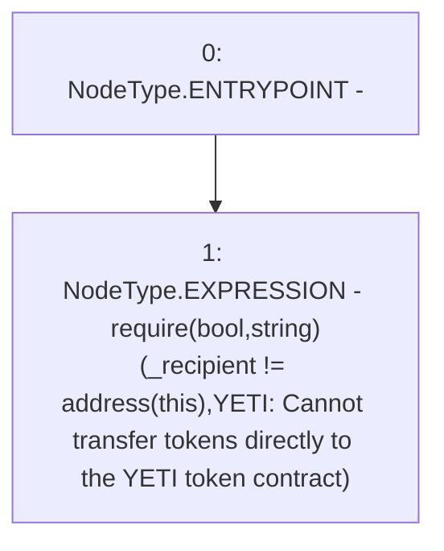

# Context: YETIToken._requireValidRecipient

**Contract:** `YETIToken` (Inherits: IYETIToken, IERC2612, IERC20)
**Signature:** `_requireValidRecipient(address)`
**Method Selector ID:** `Internal (No Method ID)`
**Visibility:** `internal`
**Environment-Free:** `Yes`
**Modifiers:** None

### State Variables Interaction
- **Reads:** None
- **Writes:** None

### Assertion Checks & Business Requirements
- require/assert: `require(bool,string)(_recipient != address(this),YETI: Cannot transfer tokens directly to the YETI token contract)`

### Environment & Verification Flags
- **Uses Foundry Cheatcodes:** No
- **Has Echidna Properties:** No

### Internal Calls Tree
- None

### External Calls / Value Transfers
- `TMP_78(None) = SOLIDITY_CALL require(bool,string)(TMP_77,YETI: Cannot transfer tokens directly to the YETI token contract)`

### Control Flow Graph (CFG)


### Source Mapping
Declared in: `certora-ac-datasets/detasets/web3bugs/dataset/web3bugs/66/packages/contracts/contracts/YETI/YETIToken.sol` on lines **215** to **220**

```solidity
    function _requireValidRecipient(address _recipient) internal view {
        require(
            _recipient != address(this),
            "YETI: Cannot transfer tokens directly to the YETI token contract"
        );
    }

```
