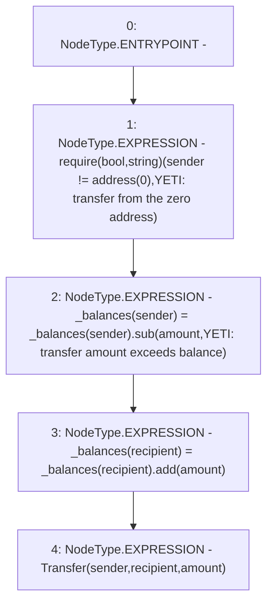

# Context: YETIToken._transfer

**Contract:** `YETIToken` (Inherits: IYETIToken, IERC2612, IERC20)
**Signature:** `_transfer(address,address,uint256)`
**Method Selector ID:** `Internal (No Method ID)`
**Visibility:** `internal`
**Environment-Free:** `Yes`
**Modifiers:** None

### State Variables Interaction
- **Reads:** _balances
- **Writes:** _balances

### Assertion Checks & Business Requirements
- require/assert: `require(bool,string)(sender != address(0),YETI: transfer from the zero address)`

### Environment & Verification Flags
- **Uses Foundry Cheatcodes:** No
- **Has Echidna Properties:** No

### Internal Calls Tree
- None

### External Calls / Value Transfers
- `TMP_71(None) = SOLIDITY_CALL require(bool,string)(TMP_70,YETI: transfer from the zero address)`
- `SafeMath.TMP_72(uint256) = LIBRARY_CALL, dest:SafeMath, function:SafeMath.sub(uint256,uint256,string), arguments:['REF_25', 'amount', 'YETI: transfer amount exceeds balance'] `
- `SafeMath.TMP_73(uint256) = LIBRARY_CALL, dest:SafeMath, function:SafeMath.add(uint256,uint256), arguments:['REF_28', 'amount'] `

### Control Flow Graph (CFG)


### Source Mapping
Declared in: `certora-ac-datasets/detasets/web3bugs/dataset/web3bugs/66/packages/contracts/contracts/YETI/YETIToken.sol` on lines **198** to **204**

```solidity
    function _transfer(address sender, address recipient, uint256 amount) internal {
        require(sender != address(0), "YETI: transfer from the zero address");

        _balances[sender] = _balances[sender].sub(amount, "YETI: transfer amount exceeds balance");
        _balances[recipient] = _balances[recipient].add(amount);
        emit Transfer(sender, recipient, amount);
    }

```
