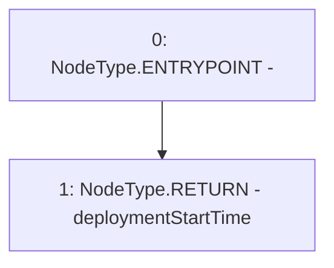

# Context: YETIToken.getDeploymentStartTime

**Contract:** `YETIToken` (Inherits: IYETIToken, IERC2612, IERC20)
**Signature:** `getDeploymentStartTime() returns (uint256)`
**Method Selector ID:** `0x3c84b7c2`
**Visibility:** `external`
**Environment-Free:** `Yes`
**Modifiers:** None

### State Variables Interaction
- **Reads:** deploymentStartTime
- **Writes:** None

### Environment & Verification Flags
- **Uses Foundry Cheatcodes:** No
- **Has Echidna Properties:** No

### Internal Calls Tree
- None

### External Calls / Value Transfers
- None

### Control Flow Graph (CFG)


### Source Mapping
Declared in: `certora-ac-datasets/detasets/web3bugs/dataset/web3bugs/66/packages/contracts/contracts/YETI/YETIToken.sol` on lines **241** to **243**

```solidity
    function getDeploymentStartTime() external view override returns (uint256) {
        return deploymentStartTime;
    }

```
