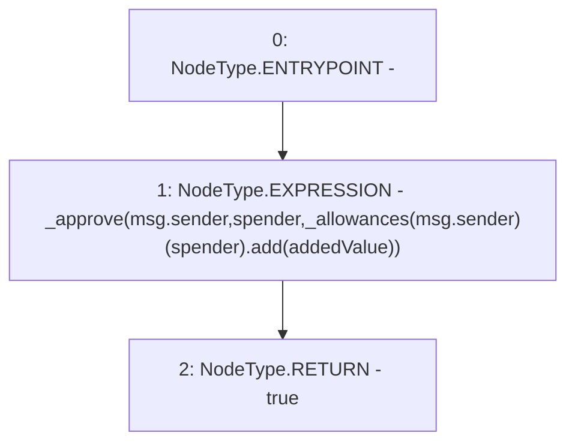

# Context: YETIToken.increaseAllowance

**Contract:** `YETIToken` (Inherits: IYETIToken, IERC2612, IERC20)
**Signature:** `increaseAllowance(address,uint256) returns (bool)`
**Method Selector ID:** `0x39509351`
**Visibility:** `external`
**Environment-Free:** `No (reads EVM state context)`
**Modifiers:** None

### State Variables Interaction
- **Reads:** _allowances
- **Writes:** None

### Environment & Verification Flags
- **Uses Foundry Cheatcodes:** No
- **Has Echidna Properties:** No

### Internal Calls Tree
- None

### External Calls / Value Transfers
- `SafeMath.TMP_40(uint256) = LIBRARY_CALL, dest:SafeMath, function:SafeMath.add(uint256,uint256), arguments:['REF_14', 'addedValue'] `

### Control Flow Graph (CFG)


### Source Mapping
Declared in: `certora-ac-datasets/detasets/web3bugs/dataset/web3bugs/66/packages/contracts/contracts/YETI/YETIToken.sol` on lines **132** to **135**

```solidity
    function increaseAllowance(address spender, uint256 addedValue) external override returns (bool) {
        _approve(msg.sender, spender, _allowances[msg.sender][spender].add(addedValue));
        return true;
    }

```
