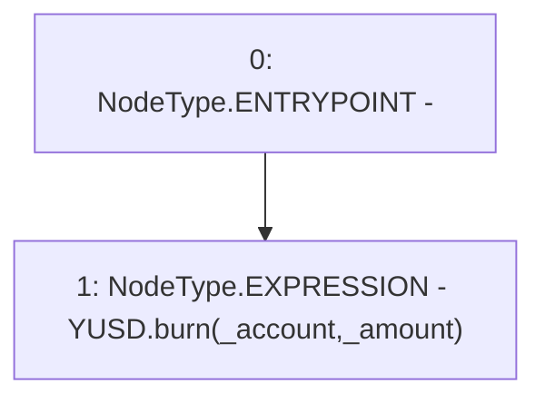

# Context: YUSDTokenCaller.yusdBurn

**Contract:** `YUSDTokenCaller` (Inherits: None)
**Signature:** `yusdBurn(address,uint256)`
**Method Selector ID:** `0xa2472dd5`
**Visibility:** `external`
**Environment-Free:** `Yes`
**Modifiers:** None

### State Variables Interaction
- **Reads:** YUSD
- **Writes:** None

### Environment & Verification Flags
- **Uses Foundry Cheatcodes:** No
- **Has Echidna Properties:** No

### Internal Calls Tree
- None

### External Calls / Value Transfers
- `IYUSDToken.HIGH_LEVEL_CALL, dest:YUSD(IYUSDToken), function:burn, arguments:['_account', '_amount']  `

### Control Flow Graph (CFG)


### Source Mapping
Declared in: `certora-ac-datasets/detasets/web3bugs/dataset/web3bugs/66/packages/contracts/contracts/TestContracts/LUSDTokenCaller.sol` on lines **18** to **20**

```solidity
    function yusdBurn(address _account, uint _amount) external {
        YUSD.burn(_account, _amount);
    }

```
