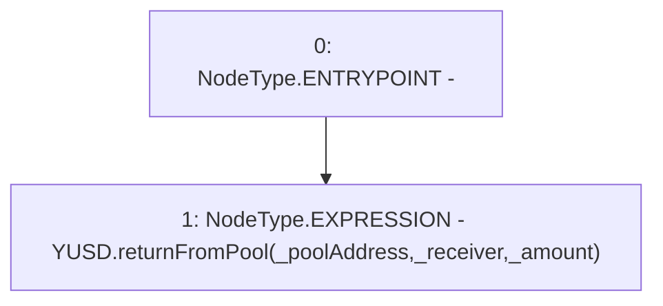

# Context: YUSDTokenCaller.yusdReturnFromPool

**Contract:** `YUSDTokenCaller` (Inherits: None)
**Signature:** `yusdReturnFromPool(address,address,uint256)`
**Method Selector ID:** `0x8f3e6185`
**Visibility:** `external`
**Environment-Free:** `Yes`
**Modifiers:** None

### State Variables Interaction
- **Reads:** YUSD
- **Writes:** None

### Environment & Verification Flags
- **Uses Foundry Cheatcodes:** No
- **Has Echidna Properties:** No

### Internal Calls Tree
- None

### External Calls / Value Transfers
- `IYUSDToken.HIGH_LEVEL_CALL, dest:YUSD(IYUSDToken), function:returnFromPool, arguments:['_poolAddress', '_receiver', '_amount']  `

### Control Flow Graph (CFG)


### Source Mapping
Declared in: `certora-ac-datasets/detasets/web3bugs/dataset/web3bugs/66/packages/contracts/contracts/TestContracts/LUSDTokenCaller.sol` on lines **26** to **28**

```solidity
    function yusdReturnFromPool(address _poolAddress, address _receiver, uint256 _amount ) external {
        YUSD.returnFromPool(_poolAddress, _receiver, _amount);
    }

```
