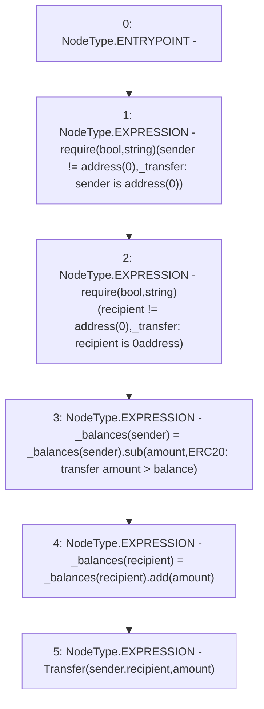

# Context: YUSDTokenTester._transfer

**Contract:** `YUSDTokenTester` (Inherits: YUSDToken, IYUSDToken, IERC2612, IERC20, CheckContract)
**Signature:** `_transfer(address,address,uint256)`
**Method Selector ID:** `Internal (No Method ID)`
**Visibility:** `internal`
**Environment-Free:** `Yes`
**Modifiers:** None

### State Variables Interaction
- **Reads:** _balances
- **Writes:** _balances

### Assertion Checks & Business Requirements
- require/assert: `require(bool,string)(sender != address(0),_transfer: sender is address(0))`
- require/assert: `require(bool,string)(recipient != address(0),_transfer: recipient is 0address)`

### Environment & Verification Flags
- **Uses Foundry Cheatcodes:** No
- **Has Echidna Properties:** No

### Internal Calls Tree
- None

### External Calls / Value Transfers
- `TMP_85(None) = SOLIDITY_CALL require(bool,string)(TMP_84,_transfer: sender is address(0))`
- `TMP_88(None) = SOLIDITY_CALL require(bool,string)(TMP_87,_transfer: recipient is 0address)`
- `SafeMath.TMP_90(uint256) = LIBRARY_CALL, dest:SafeMath, function:SafeMath.add(uint256,uint256), arguments:['REF_22', 'amount'] `
- `SafeMath.TMP_89(uint256) = LIBRARY_CALL, dest:SafeMath, function:SafeMath.sub(uint256,uint256,string), arguments:['REF_19', 'amount', 'ERC20: transfer amount > balance'] `

### Control Flow Graph (CFG)


### Source Mapping
Declared in: `certora-ac-datasets/detasets/web3bugs/dataset/web3bugs/66/packages/contracts/contracts/YUSDToken.sol` on lines **228** to **235**

```solidity
    function _transfer(address sender, address recipient, uint256 amount) internal {
        require(sender != address(0), "_transfer: sender is address(0)");
        require(recipient != address(0), "_transfer: recipient is 0address");

        _balances[sender] = _balances[sender].sub(amount, "ERC20: transfer amount > balance");
        _balances[recipient] = _balances[recipient].add(amount);
        emit Transfer(sender, recipient, amount);
    }

```
