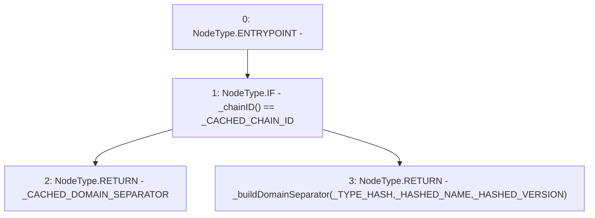

# Context: YUSDTokenTester.domainSeparator

**Contract:** `YUSDTokenTester` (Inherits: YUSDToken, IYUSDToken, IERC2612, IERC20, CheckContract)
**Signature:** `domainSeparator() returns (bytes32)`
**Method Selector ID:** `0xf698da25`
**Visibility:** `public`
**Environment-Free:** `Yes`
**Modifiers:** None

### State Variables Interaction
- **Reads:** _CACHED_CHAIN_ID, _CACHED_DOMAIN_SEPARATOR, _HASHED_NAME, _HASHED_VERSION, _TYPE_HASH
- **Writes:** None

### Environment & Verification Flags
- **Uses Foundry Cheatcodes:** No
- **Has Echidna Properties:** No

### Internal Calls Tree
- None

### External Calls / Value Transfers
- None

### Control Flow Graph (CFG)


### Source Mapping
Declared in: `certora-ac-datasets/detasets/web3bugs/dataset/web3bugs/66/packages/contracts/contracts/YUSDToken.sol` on lines **178** to **184**

```solidity
    function domainSeparator() public view override returns (bytes32) {    
        if (_chainID() == _CACHED_CHAIN_ID) {
            return _CACHED_DOMAIN_SEPARATOR;
        } else {
            return _buildDomainSeparator(_TYPE_HASH, _HASHED_NAME, _HASHED_VERSION);
        }
    }

```
