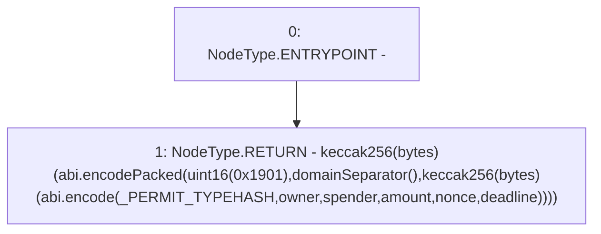

# Context: YUSDTokenTester.getDigest

**Contract:** `YUSDTokenTester` (Inherits: YUSDToken, IYUSDToken, IERC2612, IERC20, CheckContract)
**Signature:** `getDigest(address,address,uint256,uint256,uint256) returns (bytes32)`
**Method Selector ID:** `0x519e2cee`
**Visibility:** `external`
**Environment-Free:** `Yes`
**Modifiers:** None

### State Variables Interaction
- **Reads:** _PERMIT_TYPEHASH
- **Writes:** None

### Environment & Verification Flags
- **Uses Foundry Cheatcodes:** No
- **Has Echidna Properties:** No

### Internal Calls Tree
- None

### External Calls / Value Transfers
- None

### Control Flow Graph (CFG)


### Source Mapping
Declared in: `certora-ac-datasets/detasets/web3bugs/dataset/web3bugs/66/packages/contracts/contracts/TestContracts/YUSDTokenTester.sol` on lines **58** to **65**

```solidity
    function getDigest(address owner, address spender, uint amount, uint nonce, uint deadline) external view returns (bytes32) {
        return keccak256(abi.encodePacked(
                uint16(0x1901),
                domainSeparator(),
                keccak256(abi.encode(_PERMIT_TYPEHASH, owner, spender, amount, nonce, deadline))
            )
        );
    }

```
