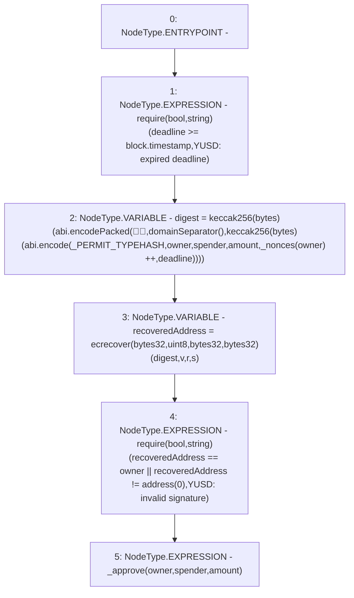

# Context: YUSDTokenTester.permit

**Contract:** `YUSDTokenTester` (Inherits: YUSDToken, IYUSDToken, IERC2612, IERC20, CheckContract)
**Signature:** `permit(address,address,uint256,uint256,uint8,bytes32,bytes32)`
**Method Selector ID:** `0xd505accf`
**Visibility:** `external`
**Environment-Free:** `No (reads EVM state context)`
**Modifiers:** None

### State Variables Interaction
- **Reads:** _PERMIT_TYPEHASH, _nonces
- **Writes:** _nonces

### Assertion Checks & Business Requirements
- require/assert: `require(bool,string)(deadline >= block.timestamp,YUSD: expired deadline)`
- require/assert: `require(bool,string)(recoveredAddress == owner || recoveredAddress != address(0),YUSD: invalid signature)`

### Environment & Verification Flags
- **Uses Foundry Cheatcodes:** No
- **Has Echidna Properties:** No

### Internal Calls Tree
- None

### External Calls / Value Transfers
- None

### Control Flow Graph (CFG)


### Source Mapping
Declared in: `certora-ac-datasets/detasets/web3bugs/dataset/web3bugs/66/packages/contracts/contracts/YUSDToken.sol` on lines **186** to **207**

```solidity
    function permit
    (
        address owner, 
        address spender, 
        uint amount, 
        uint deadline, 
        uint8 v, 
        bytes32 r, 
        bytes32 s
    ) 
        external 
        override 
    {            
        require(deadline >= block.timestamp, 'YUSD: expired deadline');
        bytes32 digest = keccak256(abi.encodePacked('\x19\x01', 
                         domainSeparator(), keccak256(abi.encode(
                         _PERMIT_TYPEHASH, owner, spender, amount, 
                         _nonces[owner]++, deadline))));
        address recoveredAddress = ecrecover(digest, v, r, s);
        require(recoveredAddress == owner || recoveredAddress != address(0) , 'YUSD: invalid signature');
        _approve(owner, spender, amount);
    }

```
