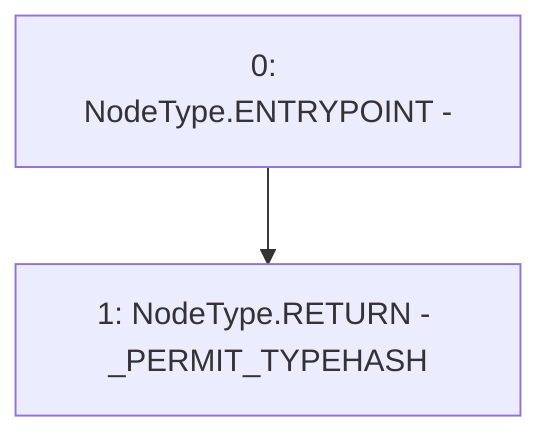

# Context: YUSDTokenTester.permitTypeHash

**Contract:** `YUSDTokenTester` (Inherits: YUSDToken, IYUSDToken, IERC2612, IERC20, CheckContract)
**Signature:** `permitTypeHash() returns (bytes32)`
**Method Selector ID:** `0x10ce43bd`
**Visibility:** `external`
**Environment-Free:** `Yes`
**Modifiers:** None

### State Variables Interaction
- **Reads:** _PERMIT_TYPEHASH
- **Writes:** None

### Environment & Verification Flags
- **Uses Foundry Cheatcodes:** No
- **Has Echidna Properties:** No

### Internal Calls Tree
- None

### External Calls / Value Transfers
- None

### Control Flow Graph (CFG)


### Source Mapping
Declared in: `certora-ac-datasets/detasets/web3bugs/dataset/web3bugs/66/packages/contracts/contracts/YUSDToken.sol` on lines **321** to **323**

```solidity
    function permitTypeHash() external view override returns (bytes32) {
        return _PERMIT_TYPEHASH;
    }

```
