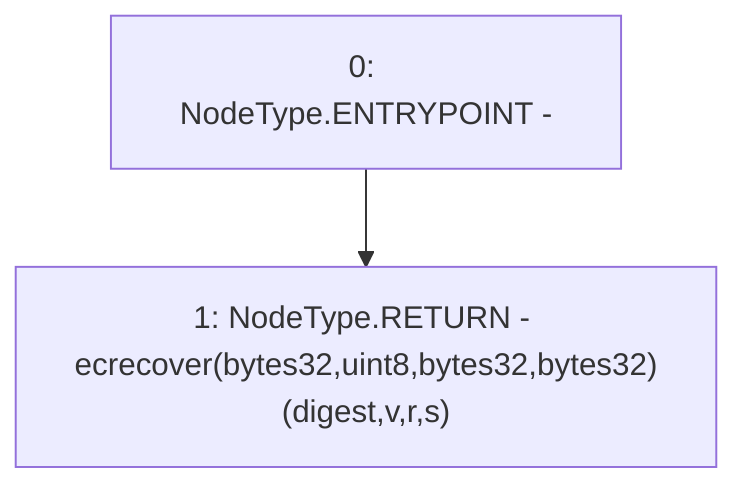

# Context: YUSDTokenTester.recoverAddress

**Contract:** `YUSDTokenTester` (Inherits: YUSDToken, IYUSDToken, IERC2612, IERC20, CheckContract)
**Signature:** `recoverAddress(bytes32,uint8,bytes32,bytes32) returns (address)`
**Method Selector ID:** `0x8428cf83`
**Visibility:** `external`
**Environment-Free:** `Yes`
**Modifiers:** None

### State Variables Interaction
- **Reads:** None
- **Writes:** None

### Environment & Verification Flags
- **Uses Foundry Cheatcodes:** No
- **Has Echidna Properties:** No

### Internal Calls Tree
- None

### External Calls / Value Transfers
- None

### Control Flow Graph (CFG)


### Source Mapping
Declared in: `certora-ac-datasets/detasets/web3bugs/dataset/web3bugs/66/packages/contracts/contracts/TestContracts/YUSDTokenTester.sol` on lines **67** to **69**

```solidity
    function recoverAddress(bytes32 digest, uint8 v, bytes32 r, bytes32 s) external pure returns (address) {
        return ecrecover(digest, v, r, s);
    }

```
