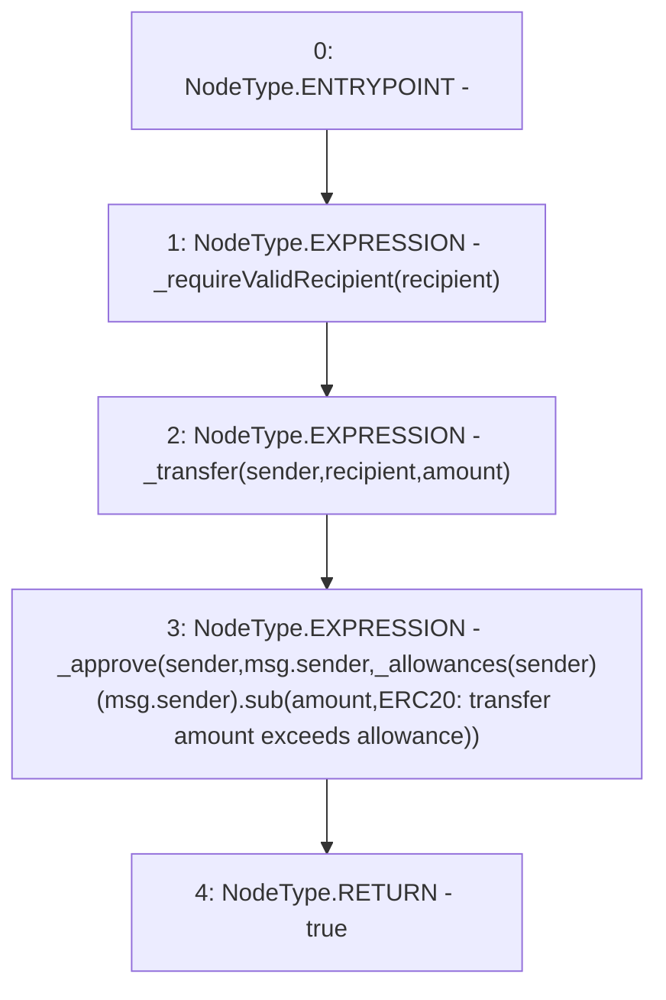

# Context: YUSDTokenTester.transferFrom

**Contract:** `YUSDTokenTester` (Inherits: YUSDToken, IYUSDToken, IERC2612, IERC20, CheckContract)
**Signature:** `transferFrom(address,address,uint256) returns (bool)`
**Method Selector ID:** `0x23b872dd`
**Visibility:** `external`
**Environment-Free:** `No (reads EVM state context)`
**Modifiers:** None

### State Variables Interaction
- **Reads:** _allowances
- **Writes:** None

### Environment & Verification Flags
- **Uses Foundry Cheatcodes:** No
- **Has Echidna Properties:** No

### Internal Calls Tree
- None

### External Calls / Value Transfers
- `SafeMath.TMP_54(uint256) = LIBRARY_CALL, dest:SafeMath, function:SafeMath.sub(uint256,uint256,string), arguments:['REF_5', 'amount', 'ERC20: transfer amount exceeds allowance'] `

### Control Flow Graph (CFG)


### Source Mapping
Declared in: `certora-ac-datasets/detasets/web3bugs/dataset/web3bugs/66/packages/contracts/contracts/YUSDToken.sol` on lines **158** to **164**

```solidity
    function transferFrom(address sender, address recipient, uint256 amount) external override returns (bool) {
        _requireValidRecipient(recipient);

        _transfer(sender, recipient, amount);
        _approve(sender, msg.sender, _allowances[sender][msg.sender].sub(amount, "ERC20: transfer amount exceeds allowance"));
        return true;
    }

```
