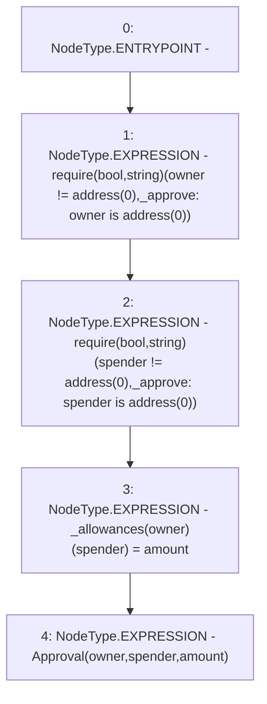

# Context: YUSDToken._approve

**Contract:** `YUSDToken` (Inherits: IYUSDToken, IERC2612, IERC20, CheckContract)
**Signature:** `_approve(address,address,uint256)`
**Method Selector ID:** `Internal (No Method ID)`
**Visibility:** `internal`
**Environment-Free:** `Yes`
**Modifiers:** None

### State Variables Interaction
- **Reads:** None
- **Writes:** _allowances

### Assertion Checks & Business Requirements
- require/assert: `require(bool,string)(owner != address(0),_approve: owner is address(0))`
- require/assert: `require(bool,string)(spender != address(0),_approve: spender is address(0))`

### Environment & Verification Flags
- **Uses Foundry Cheatcodes:** No
- **Has Echidna Properties:** No

### Internal Calls Tree
- None

### External Calls / Value Transfers
- None

### Control Flow Graph (CFG)


### Source Mapping
Declared in: `certora-ac-datasets/detasets/web3bugs/dataset/web3bugs/66/packages/contracts/contracts/YUSDToken.sol` on lines **253** to **259**

```solidity
    function _approve(address owner, address spender, uint256 amount) internal {
        require(owner != address(0), "_approve: owner is address(0)");
        require(spender != address(0), "_approve: spender is address(0)");

        _allowances[owner][spender] = amount;
        emit Approval(owner, spender, amount);
    }

```
